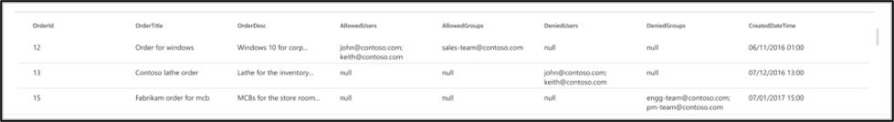

<!---Previous ms.author: vivg --->

# Azure SQL和 Microsoft SQL Server Microsoft Graph 連接器

Microsoft SQL Server或 Azure SQL Microsoft Graph 連接器可讓您的組織從內部部署SQL Server資料庫，或裝載于雲端中Azure SQL實例中的資料庫，探索並編制資料索引。
連接器會將指定的內容索引至 Microsoft Search。 若要讓索引與來源資料保持在最新狀態，它支援定期完整和累加編目。 透過這些 SQL 連接器，您也可以限制特定使用者的搜尋結果存取權。

> [!NOTE]
> 請閱讀 [**設定您的 Microsoft Graph 連接器**](configure-connector.md) 一文，以瞭解一般 Graph 連接器設定指示。

本文適用于設定、執行及監視Azure SQL或 Microsoft SQL Server 連接器的任何人。 它會補充一般設定程式，並顯示僅適用于Azure SQL和 Microsoft SQL Server 連接器的指示。 本文也包含這兩個連接器 [的限制](#limitations) 相關資訊。

## 開始之前

### 安裝內部部署 Microsoft SQL Server 連接器所需的 Microsoft Graph 連接器代理程式 (僅) 

若要存取內部部署協力廠商資料，您必須安裝並設定連接器代理程式。 若要深入瞭解，請參閱 [安裝 Microsoft Graph 連接器代理](graph-connector-agent.md) 程式。

>[!NOTE]
>如果您在設定 Microsoft SQL Server 連接器時使用Windows 驗證，則您嘗試登入的使用者必須具有安裝連接器代理程式之電腦的互動式登入許可權。 請參閱有關 [登入原則管理](/windows/security/threat-protection/security-policy-settings/allow-log-on-locally#policy-management) 的檔，以檢查登入許可權。

## 步驟 1：在Microsoft 365 系統管理中心中新增連接器

請遵循一般 [設定指示](./configure-connector.md)。
<!---If the above phrase does not apply, delete it and insert specific details for your data source that are different from general setup 
instructions.-->

## 步驟 2：命名連線

請遵循一般 [設定指示](./configure-connector.md)。
<!---If the above phrase does not apply, delete it and insert specific details for your data source that are different from general setup 
instructions.-->

## 步驟 3：設定連線設定

### 僅針對Azure SQL連接器註冊應用程式 () 

針對Azure SQL連接器，您必須在 Azure Active Directory 中註冊應用程式，以允許 Microsoft Search 應用程式存取資料以編制索引。 若要深入瞭解如何註冊應用程式，請參閱 Microsoft Graph 檔，以瞭解如何 [註冊應用程式](/graph/auth-register-app-v2)。

完成應用程式註冊並記下應用程式名稱、應用程式 (用戶端) 識別碼和租使用者識別碼之後，您必須 [產生新的用戶端密碼](/azure/healthcare-apis/register-confidential-azure-ad-client-app#application-secret)。 用戶端密碼只會顯示一次。 請記得&安全地儲存用戶端密碼。 在 Microsoft Search 中設定新連線時，請使用用戶端識別碼和用戶端密碼。

若要將已註冊的應用程式新增至Azure SQL資料庫，您需要：

- 登入您的Azure SQL資料庫
- 開啟新的查詢視窗
- 執行 'CREATE USER [app name] FROM EXTERNAL PROVIDER' 命令來建立新的使用者
- 執行 'exec sp_addrolemember 'db_datareader'、[app name]' 或 'ALTER ROLE db_datareader ADD MEMBER [app name]' 命令，將使用者新增至角色

>[!NOTE]
>若要撤銷對在 Azure Active Directory 中註冊之任何應用程式的存取權，請參閱有關 [移除已註冊應用程式的](/azure/active-directory/develop/quickstart-remove-app)Azure 檔。

### 連線設定

若要將 Microsoft SQL Server連接器連接到資料來源，您必須設定您要編目的資料庫伺服器和內部部署代理程式。 然後，您可以使用必要的驗證方法連線到資料庫。

> [!NOTE]
> - 您的資料庫必須SQL Server 2008 版或更新版本執行，Microsoft SQL Server連接器才能連線。
> - Azure SQL連接器只允許從與 Microsoft 365 相同的[租](/azure/active-directory/develop/quickstart-create-new-tenant)使用者中擷取Azure SQL實例。 不支援跨租使用者資料流程。

針對Azure SQL連接器，您只需要指定要連線的伺服器名稱或 IP 位址。 Azure SQL連接器僅支援 Azure Active Directory Open ID connect (OIDC) 驗證來連線到資料庫。

為了增加安全性，您可以為Azure SQL伺服器或資料庫設定 IP 防火牆規則。 若要深入瞭解如何設定 IP 防火牆規則，請參閱 [IP 防火牆規則](/azure/azure-sql/database/firewall-configure)的相關檔。 在防火牆設定中新增下列用戶端 IP 範圍。

| 區域 | M365 企業版 | M365 Government
| ------------ | ------------ | ------------ |
| NAM | 52.250.92.252/30, 52.224.250.216/30 | 52.245.230.216/30, 20.141.117.64/30
| EUR | 20.54.41.208/30, 51.105.159.88/30 | NA
| APC | 52.139.188.212/30, 20.43.146.44/30 | NA

若要搜尋資料庫內容，您必須在設定連接器時指定 SQL 查詢。 這些 SQL 查詢需要將您想要編制索引的所有資料庫資料行命名 (也就是來源屬性) ，包括需要執行才能取得所有資料行的任何 SQL 聯結。 若要限制對搜尋結果的存取，您必須在設定連接器時，指定 SQL 查詢內) 存取控制清單 (ACL。

## 步驟 3a：需要完整編目 () 

在此步驟中，您會設定執行資料庫完整編目的 SQL 查詢。 完整編目會選取您要選取 [ **查詢**]、[ **搜尋**] 或 [擷 **取**] 選項的所有資料行或屬性。 您也可以指定 ACL 資料行，將搜尋結果的存取限制為特定使用者或群組。

> [!Tip]
> 若要取得您需要的所有資料行，您可以聯結多個資料表。

### 選 (選 (選用) 和 ACL 資料行的資料行) 

此範例示範五個數據行的選取範圍，這些資料行會保存搜尋的資料：OrderId、OrderTitle、OrderDesc、CreatedDateTime 和 IsDeleted。 若要設定每個資料列的檢視許可權，您可以選擇性地選取下列 ACL 資料行：AllowedUsers、AllowedGroups、DeniedUsers 和 DeniedGroups。 所有這些資料行也有 **查詢**、 **搜尋** 或擷 **取** 的選項。

選取資料行，如下列範例查詢所示： `SELECT OrderId, OrderTitle, OrderDesc, AllowedUsers, AllowedGroups, DeniedUsers, DeniedGroups, CreatedDateTime, IsDeleted`

請注意，SQL 連接器不允許 SELECT 子句中具有非英數位元的資料行名稱。 使用別名，從資料行名稱中移除任何非英數位元。 範例 - SELECT *column_name* AS *columnName*

若要管理搜尋結果的存取權，您可以在查詢中指定一或多個 ACL 資料行。 SQL 連接器可讓您控制每個記錄層級的存取權。 您可以選擇對資料表中的所有記錄擁有相同的存取控制。 如果 ACL 資訊儲存在個別的資料表中，您可能必須在查詢中與這些資料表聯結。

上述查詢中每個 ACL 資料行的使用方式如下所述。 下列清單說明四 **種存取控制機制**。

- **AllowedUsers**：此資料行會指定可存取搜尋結果的使用者識別碼清單。 在下列範例中，使用者清單：john@contoso.com、keith@contoso.com 和 lisa@contoso.com 只能存取 OrderId = 12 的記錄。
- **AllowedGroups**：此資料行會指定能夠存取搜尋結果的使用者群組。 在下列範例中，群組 sales-team@contoso.com 只能存取 OrderId = 12 的記錄。
- **DeniedUsers**：此資料行會指定 **無法** 存取搜尋結果的使用者清單。 在下列範例中，使用者 john@contoso.com 和 keith@contoso.com 無法存取 OrderId = 13 的記錄，而其他人則可以存取此記錄。
- **DeniedGroups**：此資料行會指定 **無法** 存取搜尋結果的使用者群組。 在下列範例中，群組 engg-team@contoso.com 和 pm-team@contoso.com 無法存取 OrderId = 15 的記錄，而其他人則可以存取此記錄。  

### 支援的資料類型

下表摘要說明 MS SQL 和 Azure SQL 連接器中支援的 SQL 資料類型。 資料表也會摘要說明支援的 SQL 資料類型的索引資料類型。 若要深入瞭解 Microsoft Graph 連接器支援用於編制索引的資料類型，請參閱 [屬性資源類型的](/graph/api/resources/property?preserve-view=true&view=graph-rest-beta#properties)檔。

| 類別 | 源資料類型 | 編制資料類型的索引 |
| ------------ | ------------ | ------------ |
| 日期和時間 | date   datetime   datetime2   Smalldatetime | datetime |
| 精確數值 | Bigint   int   Smallint   Tinyint | int64 |
| 精確數值 | 位 | 布林值 |
| 近似數值 | float   真正 | double |
| 字元字串 | 字元   Varchar   文字 | string |
| Unicode 字元字串 | Nchar   Nvarchar   Ntext | 字串 |
| 其他資料類型 | uniqueidentifier | 字串 |

針對目前不直接支援的任何其他資料類型，資料行必須明確轉換為支援的資料類型。

### 浮水印 (必要) 

若要防止多載資料庫，連接器會使用完整編目浮水印資料行批次並繼續完整編目查詢。 使用浮水印資料行的值，會擷取每個後續批次，並從最後一個檢查點繼續查詢。 基本上，此機制會控制完整編目的資料重新整理。

建立浮水印的查詢程式碼片段，如下列範例所示：

- `WHERE (CreatedDateTime > @watermark)`. 使用保留關鍵字 `@watermark` 來寫入浮水印資料行名稱。 如果浮水印資料行的排序次序為遞增，請使用 `>` ，否則請使用 `<` 。
- `ORDER BY CreatedDateTime ASC`. 以遞增或遞減順序排序浮水印資料行。

在下圖所示的組態中， `CreatedDateTime` 是選取的水位線資料行。 若要擷取第一批資料列，請指定浮水印資料行的資料類型。 在此情況下，資料類型為 `DateTime` 。

第一個查詢會使用以下方式擷取前 **N** 個數據列數：「CreatedDateTime > 1753 年 1 月 1 日 00：00：00」 (dateTime 資料類型的最小值) 。 擷取第一個批次之後，如果資料列是以遞增順序排序，則批次中傳回的最高值 `CreatedDateTime` 會儲存為檢查點。 例如，2019 年 3 月 1 日 03：00：00。 然後在查詢中使用 「CreatedDateTime > March 1， 2019 03：00：00」 擷取下一批 **N** 個數據列。

### 略過虛刪除的資料列 (選擇性) 

若要排除資料庫中虛刪除的資料列不編制索引，請指定虛刪除資料行名稱和值，指出資料列已刪除。

### 完整編目：管理搜尋許可權

選 **取 [管理許可權]** 以選擇指定存取控制機制的各種存取控制 (ACL) 資料行。 選取您在完整編目 SQL 查詢中指定的資料行名稱。

每個 ACL 資料行都應該是多重值資料行。 這些多個識別符值可以使用分號 (;) 、逗號 (、) 等分隔符號來分隔。 您必須在值分隔符號欄位中指定此 **分隔符號** 。

使用 作為 ACL 時支援下列識別碼類型：

- **UPN)  (使用者主體名稱**：UPN)  (使用者主體名稱是電子郵件地址格式的系統使用者名稱。 例如，UPN (：john.doe@domain.com) 包含使用者名稱 (登入名稱) 、@符號)  (分隔符號，以及 UPN 尾碼)  (功能變數名稱。
- **Azure Active Directory (AAD) 識別碼**：在 Azure AD 中，每個使用者或群組都有類似 'e0d3ad3d-0000-1111-2222-3c5f5c52ab9b' 的物件識別碼。
- **Active Directory (AD) 安全性標識** 符：在內部部署 AD 安裝程式中，每個使用者和群組都有不可變的唯一安全識別碼，看起來像 'S-1-5-21-3878594291-2115959936-132693609-65242.'

## 步驟 3b：累加編目 (選擇性) 

在這個選擇性步驟中，提供 SQL 查詢來執行資料庫的累加編目。 使用此查詢時，SQL 連接器會決定自上次累加編目之後對資料所做的任何變更。 如同在完整編目中，選取您要選取 [ **查詢**]、[ **搜尋**] 或 [擷取] 選項的所有資料 **行**。 指定您在完整編目查詢中指定的同一組 ACL 資料行。

下圖中的元件類似于完整編目元件，但有一個例外狀況。 在此情況下，「ModifiedDateTime」 是選取的水位線資料行。 檢閱 [完整的編目步驟](#step-3a-full-crawl-required) ，以瞭解如何撰寫累加編目查詢，並查看下列影像作為範例。

## 步驟 4：指派屬性標籤

請遵循一般 [設定指示](./configure-connector.md)。

<!---If the above phrase does not apply, delete it and insert specific details for your data source that are different from general setup 
instructions.-->

## 步驟 5：管理架構

請遵循一般 [設定指示](./configure-connector.md)。
<!---If the above phrase does not apply, delete it and insert specific details for your data source that are different from general setup 
instructions.-->

## 步驟 6：管理搜尋許可權

您可以選擇使用 [完整搜耙畫面中指定的 ACL](#full-crawl-manage-search-permissions) ，也可以覆寫這些 ACL，讓每個人都能看到您的內容。

## 步驟 7：選擇重新整理設定

請遵循一般 [設定指示](./configure-connector.md)。
<!---If the above phrase does not apply, delete it and insert specific details for your data source that are different from general setup 
instructions.-->

## 步驟 8：檢閱連線

請遵循一般 [設定指示](./configure-connector.md)。
<!---If the above phrase does not apply, delete it and insert specific details for your data source that are different from general setup 
instructions.-->

<!---## Next steps: Customize the search results page

Create your own verticals and result types, so end users can view search results from new connections. Without this step, data from your connection won't show up on the search results page.

To learn more about how to create your verticals and MRTs, see [Search results page customization](customize-search-page.md).-->

## 疑難排解

以下是在設定連接器時觀察到的常見錯誤，以及其可能的原因。

| 設定步驟 | 錯誤訊息 | 可能的原因 ()  |
| ------------ | ------------ | ------------ |
| 完整編目 | `Error from database server: A transport level error has occurred when receiving results from the server.` | 此錯誤是因為網路問題而發生。 建議您使用 [Microsoft 網路監視器](https://www.microsoft.com/download/details.aspx?id=4865) 來檢查網路記錄，並連絡 Microsoft 客戶支援。 |
| 完整編目 | `Column column_name returned from full crawl SQL query contains non-alphanumeric character` | SELECT 子句中的資料行名稱中不允許非英數位元 (如底線) 。 使用別名重新命名資料行，並移除非英數位元 (範例 - SELECT column_name AS columnName) 。 |

## 限制

SQL 連接器在預覽版本中有下列限制：

- Microsoft SQL Server連接器：內部部署資料庫必須SQL Server 2008 版或更新版本執行。
- 裝載Azure SQL資料庫 (Microsoft 365 訂用帳戶和 Azure 訂用帳戶) 必須位於相同的 Azure Active Directory 內。
- ACL 僅支援使用使用者主體名稱 (UPN) 、Azure Active Directory (Azure AD) 或 Active Directory 安全性。
- 不支援在資料庫資料行內編制豐富內容的索引。 這類內容的範例包括 HTML、JSON、XML、Blob，以及作為資料庫資料行內連結存在的檔剖析。
