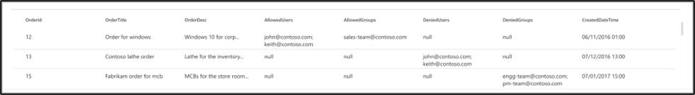
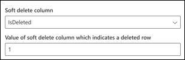
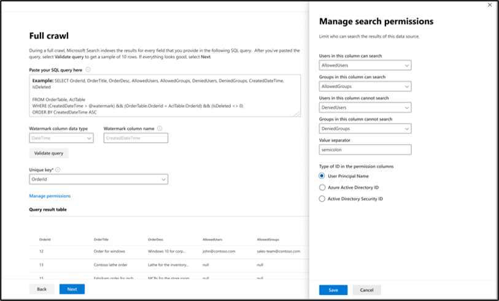
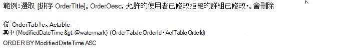

<!---Previous ms.author:vivg --->

# Oracle SQL Microsoft Graph 連接器

Oracle SQL Graph連接器可讓您的組織從內部部署 Oracle 資料庫探索資料並編制索引。 連接器會將指定的內容索引到Microsoft 搜尋。 若要讓索引與來源資料保持在最新狀態，它支援定期完整和累加編目。 使用 Oracle SQL連接器，您也可以限制特定使用者的搜尋結果存取權。

> [!NOTE]
> 請閱讀 [**Microsoft 365 系統管理中心文章中的設定 Microsoft Graph 連接器**](configure-connector.md)一文，以瞭解一般 Microsoft Graph 連接器設定指示。

本文適用于設定、執行及監視 Oracle SQL Graph連接器的任何人。 它會補充一般設定程式，並顯示僅適用于 Oracle SQL Graph連接器的指示。 本文也包含 [疑難排解](#troubleshooting) 和 [限制的相關](#limitations)資訊。

## 開始之前

### 安裝連接器代理程式

若要存取內部部署協力廠商資料，您必須安裝並設定Graph連接器代理程式。 若要深入瞭解，請參閱[安裝Graph連接器代理](graph-connector-agent.md)程式。  

## 步驟 1：在Microsoft 365 系統管理中心中新增連接器

請遵循一般 [設定指示](./configure-connector.md)。
<!---If the above phrase does not apply, delete it and insert specific details for your data source that are different from general setup instructions.-->

## 步驟 2：命名連線

請遵循一般 [設定指示](./configure-connector.md)。
<!---If the above phrase does not apply, delete it and insert specific details for your data source that are different from general setup instructions.-->

## 步驟 3：設定連線設定

若要將 Oracle SQL連接器連接到資料來源，您必須設定您要編目的資料庫伺服器和內部部署Graph連接器代理程式。 然後，您可以使用必要的驗證方法連線到資料庫。

針對 Oracle SQL連接器，您必須指定主機名稱、埠和服務 (資料庫) 名稱以及慣用的驗證方法、使用者名稱和密碼。

> [!NOTE]
> 您的資料庫必須執行 Oracle 資料庫 11g 版或更新版本，連接器才能連線。 連接器支援裝載于 Windows、Linux 和 Azure VM 平臺上的 Oracle 資料庫。

若要搜尋資料庫內容，您必須在設定連接器時指定SQL查詢。 這些SQL查詢必須為您想要編制索引的所有資料庫資料行命名 (，也就是來源屬性) ，包括需要執行才能取得所有資料行的任何SQL聯結。 若要限制對搜尋結果的存取，您必須在設定連接器時，指定) 查詢內) 存取控制清單 SQL (ACL。

## 步驟 3a：需要完整編目 () 

在此步驟中，您會設定SQL查詢，以執行資料庫的完整編目。 完整編目會選取您要選取 [ **查詢**]、[ **搜尋**] 或 [擷 **取**] 選項的所有資料行或屬性。 您也可以指定 ACL 資料行，將搜尋結果的存取限制為特定使用者或群組。

> [!Tip]
> 若要取得您需要的所有資料行，您可以聯結多個資料表。

### 選 (選 (選用) 和 ACL 資料行的資料行) 

此範例示範五個數據行的選取範圍，這些資料行會保存搜尋的資料：OrderId、OrderTitle、OrderDesc、CreatedDateTime 和 IsDeleted。 若要設定每個資料列的檢視許可權，您可以選擇性地選取下列 ACL 資料行：AllowedUsers、AllowedGroups、DeniedUsers 和 DeniedGroups。 針對所有這些資料行，您可以選取 [ **查詢**]、[ **搜尋**] 或 [擷 **取]** 選項。

選取資料行，如下列範例查詢所示： `SELECT OrderId, OrderTitle, OrderDesc, AllowedUsers, AllowedGroups, DeniedUsers, DeniedGroups, CreatedDateTime, IsDeleted`

若要管理搜尋結果的存取權，您可以在查詢中指定一或多個 ACL 資料行。 SQL連接器可讓您控制每個記錄層級的存取權。 您可以選擇對資料表中的所有記錄擁有相同的存取控制。 如果 ACL 資訊儲存在個別的資料表中，您可能必須在查詢中與這些資料表聯結。

上述查詢中每個 ACL 資料行的使用方式如下所述。 下列清單說明四 **種存取控制機制**。

* **AllowedUsers**：此選項會指定能夠存取搜尋結果的使用者識別碼清單。 在下列範例中，使用者清單：john@contoso.com、keith@contoso.com 和 lisa@contoso.com 只能存取 OrderId = 12 的記錄。
* **AllowedGroups**：此選項會指定能夠存取搜尋結果的使用者群組。 在下列範例中，群組 sales-team@contoso.com 只能存取 OrderId = 12 的記錄。
* **DeniedUsers**：此選項會指定 **無法** 存取搜尋結果的使用者清單。 在下列範例中，使用者 john@contoso.com 和 keith@contoso.com 無法存取 OrderId = 13 的記錄，而其他人則可以存取此記錄。
* **DeniedGroups**：此選項會指定 **無法** 存取搜尋結果的使用者群組。 在下列範例中，群組 engg-team@contoso.com 和 pm-team@contoso.com 無法存取 OrderId = 15 的記錄，而其他人則可以存取此記錄。  

### 支援的資料類型

下表摘要說明 Oracle SQL連接器支援的資料類型。 資料表也會摘要說明支援的SQL資料類型的索引資料類型。 若要深入瞭解 Microsoft Graph連接器支援的資料類型以編制索引，請參閱[屬性資源類型的](/graph/api/resources/property?preserve-view=true&view=graph-rest-beta#properties)檔。

| 類別 | 源資料類型 | 編制資料類型的索引 |
| ------------ | ------------ | ------------ |
| 數位資料類型 | NUMBER (p，0)  | int64 (for p <= 18)    p > 18) 的雙 ( |
| 浮點數資料類型 | NUMBER (p，s)    FLOAT (p)  | double |
| 日期資料類型 | 日期   時間 戳   TIMESTAMP (n)  | datetime |
| 字元資料類型 | CHAR (n)    VARCHAR   VARCHAR2   長   CLOB   NCLOB | 字串 |
| Unicode 字元資料類型 | NCHAR   NVARCHAR | 字串 |
| RowID 資料類型 | ROWID   UROWID | 字串 |

針對目前不直接支援的任何其他資料類型，資料行必須明確轉換為支援的資料類型。

### 浮水印 (必要) 

若要防止多載資料庫，連接器會使用完整編目浮水印資料行批次並繼續完整編目查詢。 使用浮水印資料行的值，會擷取每個後續批次，並從最後一個檢查點繼續查詢。 基本上，這是控制完整編目資料重新整理的機制。

建立浮水印的查詢程式碼片段，如下列範例所示：

* `WHERE (CreatedDateTime > @watermark)`. 使用保留關鍵字 `@watermark` 來寫入浮水印資料行名稱。 您只能以遞增順序排序浮水印資料行。
* `ORDER BY CreatedDateTime ASC`. 以遞增順序排序浮水印資料行。

在下圖所示的組態中， `CreatedDateTime` 是選取的水位線資料行。 若要擷取第一批資料列，請指定浮水印資料行的資料類型。 在此情況下，資料類型為 `DateTime` 。

第一個查詢會使用以下方式擷取前 **N** 個數據列數：「CreatedDateTime > 1753 年 1 月 1 日 00：00：00」 (dateTime 資料類型的最小值) 。 擷取第一個批次之後，如果資料列是以遞增順序排序，則批次中傳回的最高值 `CreatedDateTime` 會儲存為檢查點。 例如，2019 年 3 月 1 日 03：00：00。 然後在查詢中使用 「CreatedDateTime > March 1， 2019 03：00：00」 擷取下一批 **N** 個數據列。

### 略過虛刪除的資料列 (選擇性) 

若要排除資料庫中虛刪除的資料列不編制索引，請指定虛刪除資料行名稱和值，指出資料列已刪除。

### 完整編目：管理搜尋許可權

選 **取 [管理許可權]** 以選擇指定存取控制機制的各種存取控制 (ACL) 資料行。 選取您在完整編目SQL查詢中指定的資料行名稱。

每個 ACL 資料行都應該是多重值資料行。 這些多個識別符值可以使用分號 (;) 、逗號 (、) 等分隔符號來分隔。 您必須在值分隔符號欄位中指定此 **分隔符號** 。

使用 作為 ACL 時支援下列識別碼類型：

* **UPN)  (使用者主體名稱**：UPN)  (使用者主體名稱是電子郵件地址格式的系統使用者名稱。 例如，UPN (：john.doe@domain.com) 包含使用者名稱 (登入名稱) 、@符號)  (分隔符號，以及 UPN 尾碼)  (功能變數名稱。
* **Azure Active Directory (AAD) 識別碼**：在 Azure AD 中，每個使用者或群組都有類似 'e0d3ad3d-0000-1111-2222-3c5f5c52ab9b' 的物件識別碼
* **Active Directory (AD) 安全性標識** 符：在內部部署 AD 安裝程式中，每個使用者和群組都有不可變的唯一安全識別碼，看起來像 'S-1-5-21-3878594291-2115959936-132693609-65242.'

## 步驟 3b：累加編目 (選擇性) 

在這個選擇性步驟中，提供SQL查詢來執行資料庫的累加編目。 使用此查詢時，SQL連接器會決定自上次累加編目之後對資料所做的任何變更。 如同在完整編目中，選取 **[查詢**]、[ **搜尋**] 或 [ **擷取]** 選項。 指定您在完整編目查詢中指定的同一組 ACL 資料行。

下圖中的元件類似于完整編目元件，但有一個例外狀況。 在此情況下，「ModifiedDateTime」 是選取的水位線資料行。 檢閱 [完整的編目步驟](#step-3a-full-crawl-required) ，以瞭解如何撰寫累加編目查詢，並查看下列影像作為範例。

## 步驟 4：指派屬性標籤

請遵循一般 [設定指示](./configure-connector.md)。
<!---If the above phrase does not apply, delete it and insert specific details for your data source that are different from general setup instructions.-->

## 步驟 5：管理架構

請遵循一般 [設定指示](./configure-connector.md)。
<!---If the above phrase does not apply, delete it and insert specific details for your data source that are different from general setup instructions.-->

## 步驟 6：管理搜尋許可權

您可以選擇使用 [完整搜耙畫面中指定的 ACL](#full-crawl-manage-search-permissions) ，也可以覆寫這些 ACL，讓每個人都能看到您的內容。

## 步驟 7：選擇重新整理設定

Oracle SQL連接器支援完整和增量編目的重新整理排程。 我們建議您設定兩者。

完整編目排程會尋找先前同步至Microsoft 搜尋索引的已刪除資料列，以及移出同步篩選的任何資料列。 當您第一次連線到資料庫時，會執行完整編目來同步處理從完整編目查詢擷取的所有資料列。 若要同步處理新的資料列並進行更新，您需要排程累加編目。

## 步驟 8：檢閱連線

請遵循一般 [設定指示](./configure-connector.md)。
<!---If the above phrase does not apply, delete it and insert specific details for your data source that are different from general setup instructions.-->

<!--- ## Next steps: Customize the search results page

Create your own verticals and result types, so end users can view search results from new connections. Without this step, data from your connection won't show up on the search results page.

To learn more about how to create your verticals and MRTs, see [Search results page customization](customize-search-page.md). -->

## 疑難排解

下面是設定連接器時觀察到的常見錯誤清單及其可能的原因。

| 設定步驟 | 錯誤訊息 | 可能的原因 ()  |
| ------------ | ------------ | ------------ |
| 資料庫設定 | 來自資料庫伺服器的錯誤：連線要求逾時 | 不正確主機名稱   主機無法連線 |
| 資料庫設定 | 來自資料庫伺服器的錯誤：ORA-12541：TNS：沒有接聽程式 | 不正確埠 |
| 資料庫設定 | 來自資料庫伺服器的錯誤：ORA-12514：TNS：接聽程式目前不知道連接器描述元中要求的服務 | 不正確服務 (資料庫) 名稱 |
| 資料庫設定 | 來自資料庫伺服器的錯誤：使用者 ' `user` ' 的登入失敗。 | 不正確使用者名稱或密碼 |
| 完整編目 | 從完整編目SQL查詢傳回的資料行column_name包含非英數位元 | SELECT 子句中的資料行名稱中不允許非英數位元 (如底線) 。 使用別名重新命名資料行，並移除非英數位元 (範例 - SELECT column_name AS columnName) 。 |

## 限制

Oracle SQL連接器在預覽版本中有下列限制：

* 內部部署資料庫必須執行 Oracle Database 11g 版或更新版本。
* ACL 僅支援使用使用者主體名稱 (UPN) 、Azure Active Directory (Azure AD) 或 Active Directory 安全性。
* 不支援在資料庫資料行內編制豐富內容的索引。 這類內容的範例包括 HTML、JSON、XML、Blob，以及作為資料庫資料行內連結存在的檔剖析。
