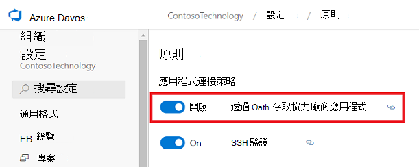
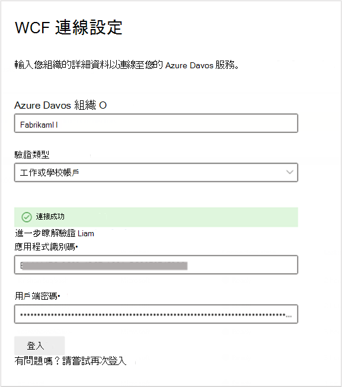
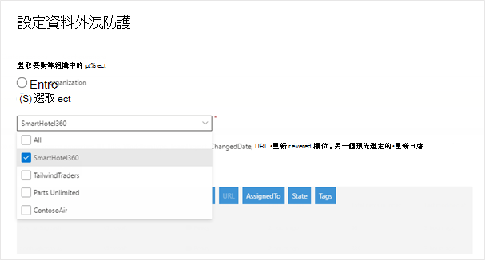
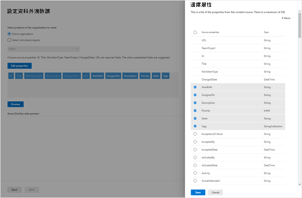

<!---Previous ms.author: shgrover --->

# Azure DevOps 工作專案 Microsoft Graph 連接器

Azure DevOps Graph 連接器可讓您的組織在其 Azure DevOps 服務實例中為工作專案編制索引。 從 Azure DevOps 設定連接器和索引內容之後，使用者可以在 Microsoft Search 中搜尋這些專案。

> [!NOTE]
> 請閱讀 [**Microsoft Graph 連接器的安裝**](configure-connector.md) 程式一文，以瞭解一般連接器設定指示。

本文適用于設定、執行及監視 Azure DevOps 連接器的任何人。 它會補充一般設定程式，並顯示僅適用于此連接器的指示。

>[!IMPORTANT]
>Azure DevOps 連接器僅支援 Azure DevOps 雲端服務。 此連接器不支援 Azure DevOps Server 2019、TFS 2018、TFS 2017、TFS 2015 和 TFS 2013。

<!---## Before you get started-->
## 開始之前
您必須是組織 M365 租使用者的系統管理員，以及組織 Azure DevOps 實例的系統管理員。

若要允許連接器連線到您的 Azure DevOps 組織，您必須透過 **OAuth 啟用協力廠商應用程式存取**。 若要深入瞭解，請參閱 Azure DevOps 檔以 [管理安全性原則](/azure/devops/organizations/accounts/change-application-access-policies?view=azure-devops#manage-a-policy&preserve-view=true) 。

您需要將下列許可權授與在連接器設定期間使用認證的使用者帳戶：

| 許可權名稱 | 許可權類型 | 的必要專案 |
| ------------ | ------------ | ------------ |
| 檢視專案層級資訊 | [專案許可權](/azure/devops/organizations/security/permissions?view=azure-devops&tabs=preview-page#project-level-permissions&preserve-view=true) | 編目 Azure DevOps 工作專案。 此許可權是需要編制索引之專案的 **必要** 許可權。 |
| _檢視分析_ | [專案許可權](/azure/devops/organizations/security/permissions?view=azure-devops&tabs=preview-page#project-level-permissions&preserve-view=true) | 編目 Azure DevOps 工作專案。 此許可權是需要編制索引之專案的 **必要** 許可權。 |
| _檢視此節點中的工作專案_ | [區域路徑](/azure/devops/organizations/security/permissions?view=azure-devops&tabs=preview-page#area-path-object-level&preserve-view=true) | 在區域路徑中編目工作專案。 此許可權是 **選擇性的**。 只有那些區域路徑會編目使用者帳戶具有許可權的區域路徑。 |

## 步驟 1：在Microsoft 365 系統管理中心中新增連接器

請遵循一般 [設定指示](./configure-connector.md)。
<!---If the above phrase does not apply, delete it and insert specific details for your data source that are different from general setup 
instructions.-->

## 步驟 2：命名連線

請遵循一般 [設定指示](./configure-connector.md)。
<!---If the above phrase does not apply, delete it and insert specific details for your data source that are different from general setup 
instructions.-->

## 步驟 3：設定連線設定

若要連線到您的 Azure DevOps 實例，您需要 Azure DevOps [組織](/azure/devops/organizations/accounts/create-organization) 名稱、其應用程式識別碼，以及 OAuth 驗證的用戶端密碼。

### 註冊應用程式

在 Azure DevOps 中註冊應用程式，讓 Microsoft Search 應用程式可以存取實例。 若要深入瞭解，請參閱 Azure DevOps 檔，以瞭解如何 [註冊應用程式](/azure/devops/integrate/get-started/authentication/oauth?preserve-view=true&view=azure-devops#register-your-app)。

下表提供如何填寫應用程式註冊表單的指引：

必要欄位 | 描述 | 建議值
--- | --- | ---
| 公司名稱         | 您的公司名稱。 | 使用適當的值   |
| 應用程式名稱     | 識別您正在授權之應用程式的唯一值。    | Microsoft 搜尋     |
| 應用程式網站  | 在連接器設定期間要求存取 Azure DevOps 實例的應用程式 URL。  (必要) 。  | 針對 **M365 Enterprise**：HTTPs:// gcs.office。com/，  針對 **M365 Government**：HTTPs://  gcsgcc。 office.com/
| 授權回呼 URL        | 授權伺服器重新導向的必要回呼 URL。 | 針對 **M365 Enterprise**：HTTPs:// gcs.office。com/v1.0/admin/oauth/callback，  針對 **M365 Government**：HTTPs://  gcsgcc.office。 com/v1.0/admin/oauth/callback |
| 授權的範圍 | 應用程式的存取範圍 | 選取下列範圍：身分識別 (讀取) 、工作專案 (讀取) 、變數群組 (讀取) 、專案和小組 (讀取) 、Graph (讀取) 、分析 (讀取) |

>[!IMPORTANT]
>您為應用程式選取的授權範圍應該與上面所列的範圍完全相符。 如果您省略清單中的其中一個授權範圍，或新增另一個範圍，授權將會失敗。

使用上述詳細資料註冊應用程式時，您會取得將用來設定連接器的 **應用程式標識** 符和 **用戶端密碼** 。

>[!NOTE]
>若要撤銷在 Azure DevOps 中註冊之任何應用程式的存取權，請移至 Azure DevOps 實例右上方的 [使用者設定]。 選取 [設定檔]，然後在側邊窗格的 [安全性] 區段中選取 [授權]。 將滑鼠停留在授權的 OAuth 應用程式上，以查看應用程式詳細資料角落的 [撤銷] 按鈕。

### 連線設定

向 Azure DevOps 註冊 Microsoft Search 應用程式之後，您可以完成連線設定步驟。 輸入您的組織名稱、應用程式識別碼和用戶端密碼。

### 設定資料：選取專案和欄位

您可以選擇連線來為整個組織或特定專案編制索引。

如果您選擇為整個組織編制索引，組織中所有專案中的專案都會編制索引。 新專案和專案將會在建立之後的下一個編目期間編制索引。

如果您選擇個別專案，則只會編制這些專案中的工作專案索引。

> [!NOTE]
> 將檢 _視專案層級資訊_ 和檢 _視分析_ 許可權授與 Azure DevOps 專案之後，即可進行編目。

接下來，選取您想要連線到這些欄位中索引和預覽資料的欄位，再繼續進行。

## 步驟 4：管理搜尋許可權

Azure DevOps 連接器支援  **只有具有此資料來源存取權的人員** 或所有人才能看見搜尋權 **限**。 如果您選擇 **[只有具有此資料來源存取權的人員**]，則根據 Azure DevOps 中組織、專案或區域路徑層級的使用者或群組的許可權，索引資料會出現在使用者的搜尋結果中。 如果您選擇 [ **所有人**]，已編制索引的資料會出現在所有使用者的搜尋結果中。

## 步驟 5：指派屬性標籤

請遵循一般 [設定指示](./configure-connector.md)。

## 步驟 6：管理架構

請遵循一般 [設定指示](./configure-connector.md)。

## 步驟 7：選擇重新整理設定

Azure DevOps 連接器支援完整和增量編目的重新整理排程。
累加編目的建議排程為一小時，而完整編目則為一天。

## 步驟 8：檢閱連線

請遵循一般 [設定指示](./configure-connector.md)。

>[!TIP]
>**預設結果類型**
>* Azure DevOps 連接器會在連接器發佈後自動註冊 [結果類型](./customize-search-page.md#step-2-create-result-types) 。 結果類型會根據步驟 3 中選取的欄位，使用動態產生 [的結果配置](./customize-results-layout.md) 。 
>* 您可以流覽至Microsoft 365 系統管理中心中 [**的結果類型**](https://admin.microsoft.com/Adminportal/Home#/MicrosoftSearch/resulttypes)來管理結果類型 [。](https://admin.microsoft.com) 預設結果類型會命名為 「 `ConnectionId` Default」。 例如，如果您的連線識別碼為 `AzureDevOps` ，則結果配置會命名為：「AzureDevOpsDefault」
>* 此外，您可以視需要選擇建立自己的結果類型。

<!---If the above phrase does not apply, delete it and insert specific details for your data source that are different from general setup 
instructions.-->

## 疑難排解
以下是設定連接器時或在編目期間觀察到的常見錯誤，以及其可能的原因。

| 步驟 | 錯誤訊息 | 可能的原因 ()  |
| ------------ | ------------ | ------------ |
| 連線設定 | `Invalid Credentials detected. Try signing in with a different account or check the permissions for your account` | 透過 *OAuth 的協力廠商應用程式存取* 可能會停用。 請遵循管理 [安全性原則](/azure/devops/organizations/accounts/change-application-access-policies?view=azure-devops#manage-a-policy&preserve-view=true) 的步驟來啟用 OAuth。 |
| 連線設定 | `Bad state` OAuth 快顯視窗中的訊息，其中包含說明的 URL `error=InvalidScope` | 提供給已註冊應用程式的範圍錯誤。 |
| 連線設定 | `400 - Bad request` OAuth 快顯視窗中的訊息 | 不正確的應用程式識別碼 |
| 連線設定 | `BadRequest: Bad Request on api request` OAuth 快顯視窗中的訊息 | 不正確的用戶端密碼 |
| 連接器設定後 (編目時間)  | `The account associated with the connector doesn't have permission to access the item.` | 註冊的應用程式沒有任何必要的 OAuth 範圍。  (附注 - 新的 OAuth 範圍需求 'Analytics：read' 已于 2021 年 8 月 31 日推出)  |
| 連接器設定後 (編目時間)  | `You don't have permission to access this data source. You can contact the owner of this data source to request permission.` | *已停用透過 OAuth 的協力廠商應用程式存取* 。 請遵循管理 [安全性原則](/azure/devops/organizations/accounts/change-application-access-policies?view=azure-devops#manage-a-policy&preserve-view=true) 的步驟來啟用 OAuth。 |
| 連接器設定後 (編目時間)  | `Credentials associated with this data source have expired. Renew the credentials and then update the connection` | 已註冊的應用程式可能已刪除或過期。 |

<!---## Limitations-->
<!---Insert limitations for this data source-->
