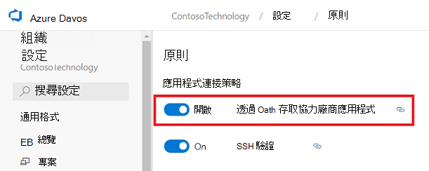

# Azure DevOps Wiki Microsoft Graph 連接器 (預覽) 

Azure DevOps Wiki Graph 連接器可讓您的組織在其 Azure DevOps 服務實例中為 Wiki 編制索引。 設定連接器之後，終端使用者可以在 Microsoft Search 中從 Azure DevOps 搜尋專案 Wiki 和程式碼 Wiki。

> [!NOTE]
> * Azure DevOps Wiki Graph 連接器處於預覽狀態。 如果您想要搶先存取以試用，請使用 [此表單](https://forms.office.com/r/JniPmK5bzm)註冊。
> * 請閱讀 [**Graph 連接器的安裝**](configure-connector.md) 程式一文，以瞭解一般 Graph 連接器設定指示。

本文適用于設定、執行及監視 Azure DevOps Wiki Graph 連接器的任何人。 它會補充一般設定程式，並顯示僅適用于 Azure DevOps Wiki Graph 連接器的指示。

>[!IMPORTANT]
>Azure DevOps Wiki 連接器僅支援 Azure DevOps 雲端服務。 此連接器不支援 Azure DevOps Server 2019、TFS 2018、TFS 2017、TFS 2015 和 TFS 2013。

<!---## Before you get started-->
## 開始之前
您必須是組織 M365 租使用者的 **搜尋** 管理員，以及組織 Azure DevOps 實例的系統管理員。

若要允許連接器連線到您的 Azure DevOps 組織，您必須透過 **OAuth 啟用協力廠商應用程式存取**。 若要深入瞭解，請參閱 Azure DevOps 檔以 [管理安全性原則](/azure/devops/organizations/accounts/change-application-access-policies?view=azure-devops#manage-a-policy&preserve-view=true) 。

您需要將下列許可權授與在連接器設定期間使用認證的使用者帳戶：

| 許可權名稱 | 許可權類型 | 的必要專案 |
| ------------ | ------------ | ------------ |
| 檢視專案層級資訊 | [專案許可權](/azure/devops/organizations/security/permissions?view=azure-devops&tabs=preview-page#project-level-permissions&preserve-view=true) | 編目 Azure DevOps 工作專案。 此許可權是需要編制索引之專案的 **必要** 許可權。 |

## 步驟 1：在 Microsoft 365 系統管理中心新增 Graph 連接器

請遵循一般 [設定指示](./configure-connector.md)。
<!---If the above phrase does not apply, delete it and insert specific details for your data source that are different from general setup 
instructions.-->

## 步驟 2：命名連線

請遵循一般 [設定指示](./configure-connector.md)。
<!---If the above phrase does not apply, delete it and insert specific details for your data source that are different from general setup 
instructions.-->

## 步驟 3：設定連線設定

若要連線到您的 Azure DevOps 實例，您需要 Azure DevOps 帳戶應用程式識別碼和用戶端密碼，才能進行 OAuth 驗證。

### 註冊應用程式

在 Azure DevOps 中註冊應用程式，讓 Microsoft Search 應用程式可以存取實例。 若要深入瞭解，請參閱 Azure DevOps 檔，以瞭解如何 [註冊應用程式](/azure/devops/integrate/get-started/authentication/oauth?preserve-view=true&view=azure-devops#register-your-app)。

下表提供如何填寫應用程式註冊表單的指引：

必要欄位 | 描述 | 建議值
--- | --- | ---
| 公司名稱         | 您的公司名稱。 | 使用適當的值   |
| 應用程式名稱     | 識別您正在授權之應用程式的唯一值。    | Microsoft 搜尋     |
| 應用程式網站  | 在連接器設定期間要求存取 Azure DevOps 實例的應用程式 URL。  (必要) 。  | HTTPs:// gcs.office。com/
| 授權回呼 URL        | 授權伺服器重新導向的必要回呼 URL。 | HTTPs:// gcs.office。com/v1.0/admin/oauth/callback|
| 授權的範圍 | 應用程式的存取範圍 | 選取下列範圍：身分識別 (讀取) 、程式碼 (讀取) 、 (讀取) 的權利、專案和小組 (讀取) 、Graph (讀取) 、MemberEntitlement 管理 (讀取) 、Wiki (讀取)  |

>[!IMPORTANT]
>為應用程式選取的授權範圍應該完全符合上面所列的範圍。 如果選取更多或更少的範圍，授權將會失敗。

使用上述詳細資料註冊應用程式時，您會取得將用來設定連接器的 **應用程式標識** 符和 **用戶端密碼** 。

>[!NOTE]
>若要撤銷在 Azure DevOps 中註冊之任何應用程式的存取權，請移至 Azure DevOps 實例右上方的 [使用者設定]。 選取 [設定檔]，然後在側邊窗格的 [安全性] 區段中選取 [授權]。 將滑鼠停留在授權的 OAuth 應用程式上，以查看應用程式詳細資料角落的 [撤銷] 按鈕。

### 連線設定

向 Azure DevOps 註冊 Microsoft Search 應用程式之後，您可以完成連線設定步驟。 輸入您的應用程式識別碼和用戶端密碼。

### 設定資料：選取組織、專案和欄位
在此步驟中，您會使用 Azure DevOps Wiki 圖形連接器指定要編制索引的資料範圍。

在第一個步驟中，您可以從您有權存取的所有組織中選擇要編制索引的組織。 然後，您可以選擇連線來為整個組織或所選組織內的特定專案編制索引。

如果您選擇為整個組織編制索引，組織中所有專案中的 Wiki 都會編制索引。 新專案和 Wiki 會在建立之後的下一個編目期間編制索引。

如果您選擇為個別專案編制索引，則只會編制所選項目中的 Wiki 索引。

## 步驟 4：管理搜尋許可權

Azure DevOps 連接器支援  **只有具有此資料來源存取權的人員** 或所有人才能看見搜尋權 **限**。 如果您選擇 **[僅限具有此資料來源存取權的人員**]，則根據 Azure DevOps 中組織、專案或 Wiki 層級的使用者或群組的許可權，索引資料會出現在使用者的搜尋結果中。 如果您選擇 [ **所有人**]，已編制索引的資料會出現在所有使用者的搜尋結果中。

## 步驟 5：指派屬性標籤

請遵循一般 [設定指示](./configure-connector.md)。

## 步驟 6：管理架構

請遵循一般 [設定指示](./configure-connector.md)。

## 步驟 7：選擇重新整理設定

Azure DevOps Wiki 連接器支援完整和增量編目的重新整理排程。
累加編目的建議排程為一小時，而完整編目則為一周。

## 步驟 8：檢閱連線

請遵循一般 [設定指示](./configure-connector.md)。

<!---If the above phrase does not apply, delete it and insert specific details for your data source that are different from general setup 
instructions.-->

## 步驟 9：設定搜尋結果頁面

發佈連線之後，您必須使用垂直和結果類型來自訂搜尋結果頁面。 若要瞭解如何自訂搜尋結果，請檢閱如何 [管理垂直](manage-verticals.md) 和 [結果類型](manage-result-types.md)。
您也可以使用 Azure DevOps Wiki 連接器的范 [例結果配置](azure-devops-wiki-connector-result-layout.md) 。 只要複製並貼上結果配置 JSON 即可開始使用。

<!---## Troubleshooting-->
<!---Insert troubleshooting recommendations for this data source-->

<!---## Limitations-->
<!---Insert limitations for this data source-->
