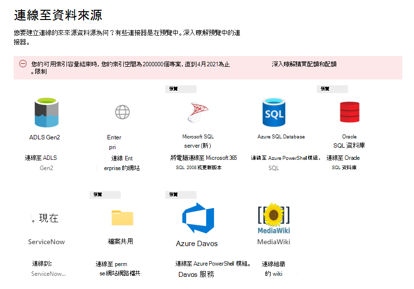
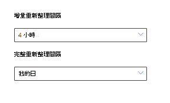

<!-- Previous ms.author: monaray -->

<!-- markdownlint-disable no-trailing-punctuation -->

# 在 Microsoft 365 系統管理中心 中設定 Microsoft Graph 連接器

本文說明在Microsoft 365 系統管理中心中設定 Microsoft Graph 連接器所需的基本[程式。](https://admin.microsoft.com) 基本程序包含下列步驟：

1. [在 Microsoft 365 系統管理中心 中新增 Microsoft Graph 連接器](#step-1-add-a-microsoft-graph-connector-in-the-microsoft-365-admin-center)
2. [為連線命名](#step-2-name-the-connection)
3. [設定連線設定](#step-3-configure-the-connection-settings)
4. [選取屬性](#step-4-select-properties)
5. [管理搜尋權限](#step-5-manage-search-permissions)
6. [指派屬性標籤](#step-6-assign-property-labels)
7. [管理結構描述](#step-7-manage-schema)
8. [重新整理設定](#step-8-refresh-settings)
9. [檢閱連線](#step-9-review-connection)
10. [自訂搜尋結果頁面](#step-10-customize-the-search-results-page)

本文也包含下列資訊：

* [疑難排解](#troubleshooting)
* [限制](#limitations)

> [!NOTE]
> 所有 Microsoft Graph連接器的安裝程式都很類似，但並不完全相同。 除了閱讀本文，請務必閱讀資料來源的連接器特定資訊。

<!---## Before you get started-->

<!---Insert "Before you get started" recommendations for this data source-->

## 步驟 1：在 Microsoft 365 系統管理中心 中新增 Microsoft Graph 連接器

完成下列步驟以設定任何 Microsoft Graph 連接器：

1. 在Microsoft 365 系統管理中心中登入您的系統[管理員](https://admin.microsoft.com)帳戶。

2. 在流覽窗格中，選 **取 [設定**]，然後選 **取 [搜尋&智慧]**。 選取 [ [資料來源] 索引標籤](https://admin.microsoft.com/Adminportal/Home#/MicrosoftSearch/Connectors)。

3. 選取 **[+新增**]，然後從可用選項的功能表中選取您選擇的資料來源。

   > [!div class="mx-imgBorder"]
   > 

> [!NOTE]
> 您可以將最多 10 個 Microsoft Graph連線新增至每個租使用者。

## 步驟 2：命名連線

指定下列屬性：

* 需要 (名稱) 
* 需要 (連線識別碼) 
* 選擇性)  (描述
* 選取必要)  (核取方塊

連線識別碼會為您的連接器建立隱含屬性。 它只能包含英數位元，且最多為 32 個字元。

## 步驟 3：設定連線設定

設定連線設定的程式會根據資料來源的類型而有所不同。 如需要新增至租使用者以在安裝程式中完成此步驟的資料來源類型，請參閱 [連接器特定資訊](/microsoftsearch/servicenow-connector#step-31-basic-authentication)。

若要深入瞭解如何連線到內部部署資料來源，請參閱[設定 Microsoft Graph連接器代理程式](/microsoftsearch/graph-connector-agent)。

## 步驟 4：選取屬性

您可以選擇由Microsoft 搜尋編制索引的屬性。

ServiceNow 查詢可用來篩選您的資料，再由Microsoft 搜尋編制索引;此查詢可讓您更充分掌控可搜尋的資料。 如需詳細資訊，請 [參閱瞭解 ServiceNow 查詢](https://go.microsoft.com/fwlink/?linkid=2151447)。

## 步驟 5：管理搜尋許可權

存取控制會列出 (ACL) 判斷貴組織中的哪些使用者可以存取每個專案。  

某些連接器，例如[Microsoft SQL](MSSQL-connector.md)和[Azure Data Lake Storage Gen2](azure-data-lake-connector.md)原生支援[Azure Active Directory (Azure AD) ](/azure/active-directory/) ACL。

[ServiceNow Knowledge、ServiceNow](servicenow-knowledge-connector.md) [Catalog](servicenow-catalog-connector.md)、[Azure DevOps 和 Salesforce](azure-devops-connector.md)等其他連接器支援非 Azure AD 使用者和群組的同步處理。  

選取每個人可讓組織中的每個人查看此資料來源的搜尋結果。

## 步驟 6：指派屬性標籤

您可以在 [指派屬性標籤] 頁面上，將語意標籤指派給來源屬性。 標籤是 Microsoft 提供的已知標籤，可提供語意意義。 它們可讓 Microsoft 將您的連接器資料整合到Microsoft 365體驗，例如增強型搜尋、人員卡片、智慧型探索等等。  

下表列出目前支援的標籤及其描述。  

標籤 | 描述
--- | ---  
**title** | 您想要在搜尋和其他體驗中顯示的專案標題
**url** | 來源系統中專案的目標 URL
**建立者** | 建立專案的人員名稱
**上次修改者** | 最近編輯專案的人員名稱
**Authors** | 參與/共同作業專案的人員名稱
**建立日期時間** | 建立專案的時間
**上次修改日期時間** | 最近編輯專案的時間
**檔案名稱** | 檔專案的名稱
**檔案副檔名** | 檔專案的類型，例如 .pdf 或 .word

此頁面上的屬性會根據您的資料來源預先選取，但如果有更適合特定標籤的不同屬性，您可以變更此選取範圍。  

標籤 **標題** 是最重要的標籤。 強烈 *建議* 您將屬性指派給此標籤，讓您的連線參與 [結果叢集體驗](result-cluster.md)。

不正確地對應標籤會導致搜尋體驗變差。 某些標籤沒有指派屬性是沒關係的。  

## 步驟 7：管理架構

### Content 屬性

建議您從選項的下拉式功能表中選取 **[內容屬性** ]，或在有內容屬性時保留預設值。 此屬性用於內容的全文檢索索引、搜尋結果頁面程式碼片段產生、 [結果叢集](result-cluster.md) 參與、語言偵測、HTML/文字支援、排名和相關性，以及查詢公式。

如果您選取內容屬性，當您 [建立結果類型](customize-results-layout.md)時，可以選擇使用系統產生的屬性 **ResultSnippet**。 這個屬性可做為查詢時從 content 屬性產生的動態程式碼片段的預留位置。 如果您在結果類型中使用此屬性，則會在搜尋結果中產生程式碼片段。

### 來源屬性的別名

您可以在 [管理架構] 頁面的 [別名] 資料行底下，將別名新增至您的屬性。 別名是您屬性的易記名稱。 它們會用於查詢和篩選的建立。 它們也會用來將多個連線的來源屬性正規化，使其具有相同的名稱。 如此一來，您就可以為具有多個連接的垂直建立單一篩選。 如需詳細資訊，請參閱 [自訂搜尋結果頁面](customize-search-page.md)。  

### 搜尋架構屬性

您可以設定搜尋架構屬性來控制每個來源屬性的搜尋功能。 搜尋架構可協助判斷搜尋結果頁面上顯示的結果，以及使用者可以檢視和存取的資訊。

搜尋架構屬性包含 **查詢**、 **搜尋**、 **擷取** 和 **精簡的** 選項。 下表列出 Microsoft Graph 連接器支援的每個屬性，並說明其功能。

搜尋架構屬性 | 函數 | 範例
--- | --- | ---
搜索 | 讓屬性的文字內容可供搜尋。 屬性內容包含在全文檢索索引中。 | 如果屬性是 **title**，**則查詢Enterprise** 會傳回答案，其中包含任何文字或標題中 **Enterprise** 字。
查詢 | 依查詢搜尋特定屬性的相符專案。 接著可以在查詢中以程式設計方式或逐字指定屬性名稱。 |  如果可以查詢 **Title** 屬性，則支援查詢 **Title： Enterprise**。
檢索 | 只有可擷取的屬性可以用於結果類型，並顯示在搜尋結果中。 |
完善 | 精簡選項可以在結果頁面Microsoft 搜尋使用。 | 如果在連線設定期間標示精簡屬性，則貴組織中的使用者可以在搜尋結果頁面上依 **URL** 進行 [篩選](custom-filters.md)。

除了檔案共用連接器以外，所有連接器都必須手動設定自訂類型。 若要啟用每個欄位的搜尋功能，您需要對應至屬性清單的搜尋架構。 連線設定助理會根據您選擇的來源屬性集合，自動選取搜尋架構。 您可以選取搜尋架構頁面上每個屬性和屬性的核取方塊來修改此架構。

:::image type="content" alt-text="您可以藉由新增或移除查詢、搜尋和擷取函式來自訂連接器的架構。" source="media/manageschema.png" lightbox="media/manageschema.png":::

### 搜尋架構設定的限制和建議

* **內容屬性** 只能搜尋。 在下拉式清單中選取它之後，此屬性就無法與選項擷 **取** 或 **查詢** 搭配使用。

* 使用 **content** 屬性轉譯搜尋結果時，會發生顯著的效能問題。 例如 [ServiceNow](https://www.servicenow.com)知識庫文章的 **[文字** 內容] 欄位。

* 只有在搜尋結果中標示為可擷取轉譯的屬性，而且可用來建立 (MRT) 的新式結果類型。

* 只有字串屬性可以標示為可搜尋。

> [!NOTE]
> 建立連線之後，就 *無法* 修改架構。 若要這樣做，您必須刪除連線並建立新的連線。

## 步驟 8：重新整理設定

重新整理間隔會決定資料來源與Microsoft 搜尋之間同步處理資料的頻率。 根據資料的修改頻率和修改類型，每種資料來源都有一組不同的最佳重新整理排程。

重新整理間隔有兩種類型： **完整重新整理** 和 **累加式重新整理**，但某些資料來源無法使用累加式重新整理。

透過完整重新整理，無論先前的編目為何，搜尋引擎都會處理內容來源中已變更的專案並編制索引。 完整重新整理最適合這些情況：

* 偵測資料刪除。
* 累加式重新整理髮現錯誤，但失敗。
* ACL 已修改。
* 編目規則已修改。
* 連線的架構已更新， (尚不支援) 架構更新。

透過 **累加式重新整理**，搜尋引擎只能處理自上次成功編目後建立或修改的專案，並編制其索引。 因此，並非內容來源中的所有資料都會重新編制索引。 累加式重新整理最適合用來偵測內容、中繼資料、許可權和其他更新。

> [!NOTE]
> 累加編目目前不支援處理權 **限** 的更新。

累加式重新整理的速度比完整重新整理快很多，因為不會處理未變更的專案。 不過，如果您選擇執行累加式重新整理，您仍然需要定期執行完整重新整理，以維持內容來源與搜尋索引之間的正確資料同步。

> [!div class="mx-imgBorder"]
> 

<!---Change screenshot for one that shows both options in new UI (try ServiceNow)--->

## 步驟 9：檢閱連線

完成連線之前，您可以視需要檢閱整個組態和編輯設定。 *如果您尚未讀取資料來源的連接器特定資訊，請務必閱讀。* 當您準備好完成連線時，請選取 [ **完成更新]**。

## 步驟 10：自訂搜尋結果頁面

發佈連線之後，您必須使用垂直和結果類型來自訂搜尋結果頁面。 若要瞭解如何自訂搜尋結果，請檢閱如何 [管理垂直](manage-verticals.md) 和 [結果類型](manage-result-types.md)。

## 步驟 11：確認連線設定是否正常運作

在 [系統管理中心的](https://admin.microsoft.com)[**連接器**] 索引標籤下，移至已發佈的連線清單。 若要瞭解如何進行更新和刪除，請參閱 [監視您的連線](manage-connector.md)。

## 疑難排解
<!---Insert troubleshooting recommendations for this data source-->
讀取資料來源的連接器特定資訊。

> [!NOTE]
> 目前，並非所有連接器特定的文章都包含疑難排解建議。

## 限制
<!---Insert limitations for this data source-->
若要瞭解適用于所有資料來源的限制，請參閱[Microsoft Graph 連接器概觀](connectors-overview.md)一文。

請參閱資料來源的連接器特定資訊，以瞭解該特定 Microsoft Graph連接器是否適用其他限制。
