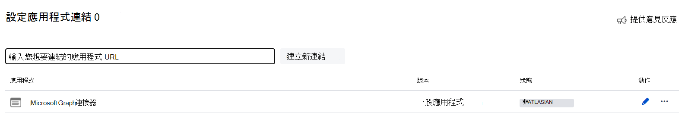

<!---Previous ms.author: kam1 --->

# <a name="confluence-on-premises-graph-connector-preview"></a>Confluence 內部部署 Graph 連接器 (預覽) 

Confluence 內部部署 Graph 連接器可讓您的組織為 Confluence server 或資料中心內容編制索引。 在您設定 Confluence 網站的連接器與索引資料之後，使用者就可以在 Microsoft 搜尋中搜尋這些內容。

>[!NOTE]
>Confluence 內部部署 Graph Connector 位於預覽中。 如果您想要取得儘早的試用權，請使用 [<b> 此表單 </b>](https://forms.office.com/r/JniPmK5bzm)註冊。

本文適用于 Microsoft 365 系統管理員或任何設定、執行及監視 Confluence 內部部署 Graph 連接器的人員。 它會補充[設定 Graph 連接器](configure-connector.md)文章中提供的一般指示。 若尚未這麼做，請閱讀整篇文章，以瞭解一般的設定程式。

安裝程式中的每個步驟都會列在下表中，也就是指出應該遵循一般設定指示或僅適用于 Confluence 內部部署 Graph 連接器（包括[疑難排解](#troubleshooting)及[限制](#limitations)的相關資訊）的說明。

## <a name="before-you-get-started"></a>開始之前

### <a name="install-the-graph-connector-agent"></a>安裝 Graph 連接器代理程式

若要編制 Confluence 伺服器或資料中心內容的索引，您必須安裝並註冊 Graph 連接器代理程式。 如需詳細資訊，請參閱[install the Graph Connector Agent](./graph-connector-agent.md) 。

您必須是組織的 Microsoft 365 租使用者和組織之 Confluence 網站的系統管理員。

## <a name="step-1-add-a-graph-connector-in-the-microsoft-365-admin-center"></a>步驟1：在 Microsoft 365 系統管理中心中新增 Graph 連接器

遵循一般 [設定指示](./configure-connector.md)。

## <a name="step-2-name-the-connection"></a>步驟2：命名連線

遵循一般 [設定指示](./configure-connector.md)。

## <a name="step-3-configure-the-connection-settings"></a>步驟3：設定連接設定

### <a name="step-31-select-deployment-type"></a>步驟3.1：選取部署類型

選取 [ *伺服器] 或 [資料中心* ] 選項，以索引 Confluence 內部部署內容，然後按 [下一步]

### <a name="step-32-enter-confluence-instance-url"></a>步驟3.2：輸入 Confluence 實例 URL

若要連接到您的 Confluence 網站，請使用您的網站 URL。

### <a name="step-33-select-the-graph-connector-agent"></a>步驟3.3：選取 Graph 連接器代理程式

從下拉式清單中選取 [Graph 連接器代理程式]。 代理程式會安全地將 Confluence 內部部署內容傳送至 Microsoft Graph 索引。

### <a name="step-34-select-authentication-type"></a>步驟3.4：選取驗證類型

您可以選擇 [基本驗證] 或 OAuth 1.0 (建議) 來驗證您的 Confluence 網站。

>[!TIP]
>請確定服務帳戶具有您要編制索引之 Confluence 內容的 **view 存取權** 。

#### <a name="basic-authentication"></a>基本驗證

輸入服務帳戶的使用者名稱 (通常是透過基本身分驗證來驗證的電子郵件識別碼) 和密碼。

#### <a name="oauth-10a-recommended"></a>OAuth 1.0 (建議) 

在 Confluence 內部部署網站中產生公開金鑰/私密金鑰配對並建立應用程式連結，讓 Graph 連接器代理程式可以存取實例。 若要深入瞭解，請參閱 [Atlassian 開發人員檔中的步驟 1](https://developer.atlassian.com/server/jira/platform/oauth/#step-1--configure-jira) ，以瞭解如何設定 OAuth 1.0 a。

#### <a name="step-341-generate-an-rsa-publicprivate-key-pair"></a>步驟3.4.1 產生 RSA 公開金鑰/私密金鑰配對

在內部部署電腦終端執行下列 openssl 命令。

步驟 | 命令
--- | ---
產生1024位私密金鑰 |```openssl genrsa -out confluence_privatekey.pem 1024```
建立 X509 憑證 |```openssl req -newkey rsa:1024 -x509 -key confluence_privatekey.pem -out confluence_publickey.cer -days 365```
解壓縮私密金鑰 (PKCS8 格式) `confluence_privatekey.pcks8` 檔案 |```openssl pkcs8 -topk8 -nocrypt -in confluence_privatekey.pem -out confluence_privatekey.pcks8```
將憑證中的公開金鑰解壓縮至 `confluence_publickey.pem` 檔案 |```openssl x509 -pubkey -noout -in confluence_publickey.cer > confluence_publickey.pem```

#### <a name="step-342-create-an-application-link"></a>步驟3.4.2 建立應用程式連結

1. 在 Confluence 中，流覽至 [**管理**] (cog 圖示，) 側邊窗格中 > **[一般**  >  設定 **應用程式] 連結**。

2. 在 [ **輸入您要連結之應用程式的 url** ] 文字方塊中，輸入任意 URL。 例如， <https://example.com> 然後按一下 [ **建立新的連結**]。 Ignore *從您輸入的 URL 接收不到回應* 警告，然後按一下 [ **繼續**]。

3. 在 [ **連結應用程式** 的第一個畫面] 對話方塊中，提供 **應用程式名稱** ，然後選取 [ **一般應用程式** 類型]。 選取 [ **建立傳入連結** ] 核取方塊。 其他所有欄位皆為選用。 按一下 [繼續]。


4. 在 [ **連結應用程式** 的第二個畫面] 對話方塊中，輸入範例用戶端的使用者詳細資料：

欄位 | 建議值
--- | ---
**使用者金鑰** | `OAuthkey`
**消費者名稱** | `Microsoft Graph Connector App`
**公開金鑰** | 從 *步驟 3.4.1* 產生的檔案複製公開金鑰 `confluence_publickey.pem` ，並將其貼到此欄位中 (例如， `iuasge87awegrq3...`) 。

5. 按一下 [繼續]。 成功建立後，應用程式連結會顯示如下畫面。



#### <a name="step-343-enter-consumer-key-and-private-key-to-sign-in"></a>步驟3.4.3 輸入使用者金鑰和私密金鑰來登入

在 Microsoft 365 系統管理中心的 [連線建立嚮導] 中，輸入步驟 *3.4.2* 時所建立的 **使用者金鑰**，以及 *步驟 3.4.1* 中 file 的 **私密金鑰** `confluence_privatekey.pcks8` 。 在瀏覽器中啟用快顯視窗以進行 Microsoft 365 系統管理中心，然後按一下 [登 **入**]。

#### <a name="step-344-enter-verification-code-to-finish-sign-in"></a>步驟3.4.4 輸入驗證碼以完成登入

在 [Confluence 登入] 畫面中，輸入服務帳戶認證。 登入成功之後，您會收到如下畫面的驗證碼。


在 [建立連線] 嚮導中輸入 **驗證碼** ，然後按一下 **[完成登入**]。 登入成功之後，按 **[下一步]**。

## <a name="step-4-select-properties"></a>步驟4：選取屬性

在這個步驟中，您可以在 Confluence 資料來源中新增或移除可用的屬性。 Microsoft 365 已經預設會選取一些屬性。

使用 Confluence 查詢語言 (CQL) 字串，您可以指定同步處理頁面的條件。 就像 **SQL Select** 語句中的 **Where** 子句。 例如，您可以選擇只為最近兩年修改的頁面編制索引。 若要瞭解如何建立您自己的查詢字串，請參閱 [使用 CQL 的高級搜尋](https://developer.atlassian.com/server/confluence/advanced-searching-using-cql/)。 依預設，所有的頁面都會由連接器編制索引。

>[!TIP]
>您可以使用 CQL 篩選來索引在特定時間（使用、 *lastModified >= "2018/12/31"* ）**後修改的內容**。

使用 [預覽結果] 按鈕，檢查所選屬性和 CQL 字串的範例值。

## <a name="step-5-manage-search-permissions"></a>步驟5：管理搜尋許可權

Confluence 內部部署 Graph 連接器可對 **所有人** 或 **只有存取此資料來源的人員** 顯示的搜尋許可權。 如果您選擇 [ **任何人**]，索引資料將會出現在所有使用者的搜尋結果中。 如果您只選擇可 **存取此資料來源的人員**，則具有存取權的使用者可在搜尋結果中顯示索引的資料。

在 Confluence 內部部署中，使用者和群組的安全性許可權是使用空間許可權和頁面限制來定義的。 Confluence 內部部署 Graph 連接器會套用 [內容限制 API](https://docs.atlassian.com/ConfluenceServer/rest/7.15.0/#api/content/{id}/restriction)所提供的 *有效許可權*。

如果您只選擇可 **存取此資料來源的人員**，您需要進一步選擇您的 Confluence 網站是否有 Azure Active Directory (AAD) 已布建的使用者或非 AAD 的使用者。

若要找出適合您組織的選項：

1. 如果 Confluence 使用者的電子郵件識別碼與 AAD 中使用者的 UserPrincipalName (UPN) **相同**，請選擇 **AAD** 選項。
2. 如果 Confluence 使用者的電子郵件識別碼 **不同** 于 AAD 中使用者的 UserPrincipalName (UPN) ，請選擇 [**非 AAD** ] 選項。 

>[!NOTE]
>
> * 如果您選擇 AAD 做為身分識別來源的類型，連接器會將從 Confluence 取得的使用者電子郵件 IDs 直接對應至 AAD 中的 UPN 屬性。
> * 如果您為身分識別類型選擇「非 AAD」，請參閱[對應您的非 Azure AD](map-non-aad.md)身分識別，以取得對應身分識別的指示。 您可以使用此選項，提供從電子郵件識別碼到 UPN 的對應正則運算式。

## <a name="step-6-assign-property-labels"></a>步驟6：指派屬性標籤

遵循一般 [設定指示](./configure-connector.md)。

## <a name="step-7-manage-schema"></a>步驟7：管理架構

遵循一般 [設定指示](./configure-connector.md)。

## <a name="step-8-choose-refresh-settings"></a>步驟8：選擇重新整理設定

遵循一般 [設定指示](./configure-connector.md)。

>[!NOTE]
>若為存取權更新，只會套用完整編目計畫。

## <a name="step-9-review-connection"></a>步驟9：檢查連線

遵循一般 [設定指示](./configure-connector.md)。

在發佈連線後，您必須自訂搜尋結果頁面。 若要瞭解如何自訂搜尋結果，請參閱 [自訂搜尋結果頁面](/microsoftsearch/configure-connector#next-steps-customize-the-search-results-page)。

## <a name="troubleshooting"></a>疑難排解

設定連接器和其可能原因時，可能會出現的常見錯誤如下所示。

| 設定步驟 | 錯誤訊息 | 可能的原因 (s)  |
| ------------ | ------------ | ------------ |
| 連接設定 | 要求格式錯誤或不正確。 | 不正確的 Confluence 網站 URL |
| 連接設定 | 無法到達 Confluence 網站的 Confluence 內部部署服務。 | 不正確的 Confluence 網站 URL |
| 連接設定 | 用戶端沒有執行該動作的許可權。 | 為基本驗證提供的密碼無效 |
| 選取屬性 | 無預覽結果 | 檢查您的 CQL 查詢是否有效且符合要編目的內容 |

## <a name="limitations"></a>限制

Confluence 內部部署 Graph 連接器在其最新版本中的已知限制如下：

* Confluence 內部部署連接器不會索引博客、附件檔案及批註。
