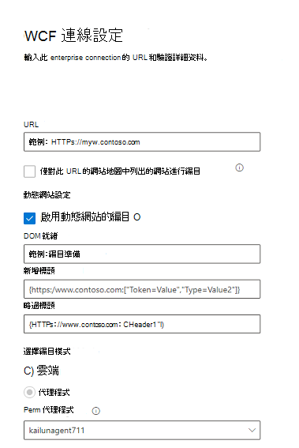
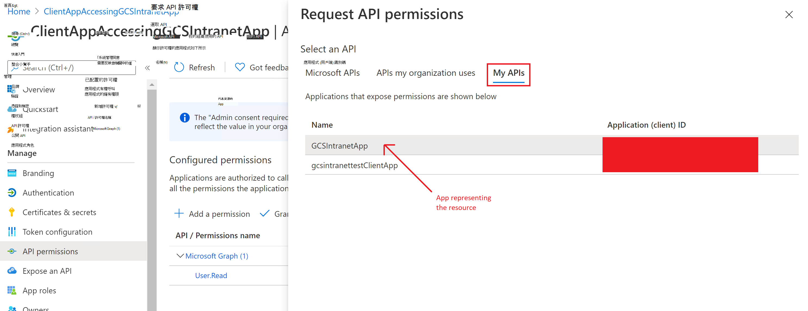
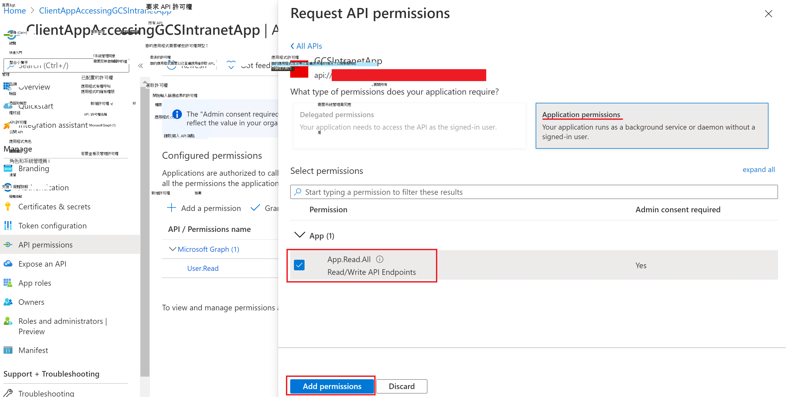

<!---Previous ms.author: monaray --->

<!-- markdownlint-disable no-inline-html -->

# Enterprise 網站 Graph 連接器

Enterprise 網站 Graph 連接器可讓您的組織編制 **來自內部網站** 的文章和內容。 從網站設定連接器及同步內容之後，使用者可以從任何 Microsoft 搜尋用戶端搜尋該內容。

> [!NOTE]
> 請閱讀 [**設定 Graph 連接器**](configure-connector.md)文章，以瞭解一般 Graph 連接器設定指示。

本文適用于任何設定、執行及監視 Enterprise 網站連接器的人員。 它會補充一般設定程式，並顯示只適用于 Enterprise 網站連接器的指示。 本文也包含 [疑難排解](#troubleshooting)的相關資訊。

<!---## Before you get started-->

<!---Insert "Before you get started" recommendations for this data source-->

## 步驟1：在 Microsoft 365 系統管理中心中新增 Graph 連接器

遵循一般 [設定指示](./configure-connector.md)。
<!---If the above phrase does not apply, delete it and insert specific details for your data source that are different from general setup instructions.-->

## 步驟2：命名連線

遵循一般 [設定指示](./configure-connector.md)。
<!---If the above phrase does not apply, delete it and insert specific details for your data source that are different from general setup instructions.-->

## 步驟3：設定連接設定

若要連線至您的資料來源，請填入網站的根 URL、選擇編目來源，以及您想要使用的驗證類型： [無]、[基本驗證]，或 OAuth 2.0 搭配[Azure Active Directory (Azure AD) ](/azure/active-directory/)]。 在您完成此資訊之後，請選取 [測試連線] 以驗證您的設定。

### URL

使用 [URL] 欄位可指定您要編目之網站的根目錄。 企業網站連接器會使用此 URL 做為開始點，並遵循此 URL 的所有連結進行編目。

### 編目網站地圖中所列的網站

選取此選項時，連接器只會編目網站地圖中所列的 URLs。 若未選取或未找到任何網站圖形，連接器將會對該網站的根 URL 所找到的所有連結進行深入編目。

### 動態網站設定

例如，如果您的網站包含動態內容，例如 Confluence 或 Unily 等內容管理系統中的網頁，您可以啟用動態編目程式。 若要將其開啟，請選取 [ **啟用動態網站的** 編目]。 編目程式會在開始編目之前，等待動態內容進行轉譯。

> [!div class="mx-imgBorder"]
> 

除了核取方塊之外，還有三個可供選用的欄位：

1. **Dom 就緒**：輸入 dom 專案，編目程式應使用它做為內容完全呈現及編目應該開始的信號。
1. **要新增的標頭**：指定編目程式在傳送該特定 web URL 時應包含的 HTTP 標頭。 您可以為不同的網站設定多個標頭。 建議包括 auth token 值。
1. **略過標頭**：指定應從動態編目要求排除的任何不必要標頭。

> [!NOTE]
> 只有代理程式編目模式支援動態編目。

### 編目模式：雲端或內部部署

編目模式會決定您要建立索引的網站類型（雲端或內部部署）。 針對您的雲端網站，選取 **雲端** 做為編目模式。

此外，連接器現在也支援對內部部署網站進行編目。 若要存取您的內部部署資料，您必須先安裝及設定 Graph 連接器代理程式。 若要深入瞭解，請參閱[Graph connector agent](./graph-connector-agent.md)。

若為您的內部部署網站，請選取 [**代理程式**] 做為編目模式，並在 [部署中的 **代理程式**] 欄位中，選擇您先前安裝及設定的 Graph 連接器代理程式。  

### 驗證

**基本驗證** 需要使用者名稱和密碼。

**OAuth 2.0** with [Azure AD](/azure/active-directory/)需要資源識別碼、用戶端識別碼和用戶端密碼。 OAuth 2.0 僅適用于雲端模式。

資源識別碼、用戶端識別碼和用戶端密碼值將取決於您為網站的 AAD 驗證設定的方式。

1. 如果您使用的是應用程式作為身分識別提供者及用戶端應用程式來存取網站，則用戶端識別碼和資源識別碼 將會是應用程式的應用程式識別碼，用戶端密碼將是您在應用程式中產生的秘密。
    
    > [!NOTE]
    > 如需將用戶端應用程式設定為身分識別提供者的詳細步驟，請參閱[快速入門：使用 Microsoft 身分識別平臺註冊應用程式，並將您的應用程式服務或 Azure 功能應用程式設定為使用 Azure AD 登入](/azure/app-service/configure-authentication-provider-aad)。

    設定用戶端應用程式後，請移至應用程式的 [ **憑證 & 機密** ] 區段，確定您建立新的用戶端密碼。 複製頁面中顯示的用戶端密碼值，因為它不會再次顯示。

    在下列螢幕擷取畫面中，您可以看到必要的步驟，以取得用戶端識別碼、用戶端密碼，並在您自行建立應用程式時，安裝應用程式。
    
    * 「署名」區段上的設定視圖：
    
      > [!div class="mx-imgBorder"]
      > [![顯示 [品牌] 頁面上的 [設定] 區段的圖像。 ](media/enterprise-web-connector//connectors-enterpriseweb-branding.png) ](media/enterprise-web-connector//connectors-enterpriseweb-branding.png#lightbox)
    
    * View the authentication 設定區段：
    
      > [!div class="mx-imgBorder"]
      > [![顯示 [驗證] 頁面上的 [設定] 區段的圖像。 ](media/enterprise-web-connector/connectors-enterpriseweb-authentication.png) ](media/enterprise-web-connector/connectors-enterpriseweb-authentication.png#lightbox)
    
      > [!NOTE]
      > 在您的網站中，不需要有以上針對重新導向 URI 所指定的路由。 只有當您在網站中使用 Azure 所傳送的使用者權杖進行驗證時，您才需要擁有該路由。
    
    * 在 **Essentials** 區段上查看用戶端識別碼：
    
      > [!div class="mx-imgBorder"]
      > [![顯示 [essentials] 區段上之用戶端識別碼的圖像。 ](media/enterprise-web-connector/connectors-enterpriseweb-clientapp-clientidresource-Id.png) ](media/enterprise-web-connector/connectors-enterpriseweb-clientapp-clientidresource-Id.png#lightbox)
    
    * 在 [ **憑證 & 秘訣** ] 區段中查看用戶端密碼：
    
      > [!div class="mx-imgBorder"]
      > 
    
2. 如果您是使用應用程式作為資源的身分識別提供者，另一個應用程式存取網站，則用戶端識別碼將會是第二個應用程式的應用程式識別碼，而用戶端密碼將是第二個應用程式中設定的密碼。 不過，資源識別碼 將會是第一個應用程式的識別碼。

    > [!NOTE]
    > 如需將用戶端應用程式設定為身分識別提供者的步驟，請參閱[快速入門：使用 Microsoft 身分識別平臺註冊應用程式](/azure/active-directory/develop/quickstart-register-app)，並[將應用程式服務或 Azure 功能應用程式設定為使用 Azure AD 登](/azure/app-service/configure-authentication-provider-aad)入。

    您不需要在此應用程式中設定用戶端密碼，但 wou 將需要在應用程式的應用程式 **角色** 區段中新增應用程式角色，之後將會指派給您的用戶端應用程式。 在下列螢幕擷取畫面中，您可以瞭解如何新增應用程式角色。

    * 建立新的應用程式角色：
    
      > [!div class="mx-imgBorder"]
      > 
    
    * 編輯新的應用程式角色：
    
      > [!div class="mx-imgBorder"]
      > 
    
      設定資源 app 後，您必須建立用戶端應用程式，並在用戶端應用程式的 API 許可權中新增以上所設定的應用程式角色，以授與存取資源 app 的許可權。 
    
      > [!NOTE]
      > 若要查看如何授與用戶端應用程式的許可權，請參閱 [快速入門：設定用戶端應用程式來存取 WEB API](/azure/active-directory/develop/quickstart-configure-app-access-web-apis)。
    
    下列螢幕擷取畫面顯示將許可權授與用戶端應用程式的區段。
    
    * 新增許可權：
    
      > [!div class="mx-imgBorder"]
      > 
    
    * 選取許可權：
    
      > [!div class="mx-imgBorder"]
      > 
    
    * 新增許可權：
 
      > [!div class="mx-imgBorder"]
      > 
    
    指派許可權之後，您將需要移至 [憑證 & 機密] 區段，為此應用程式建立新的用戶端密碼。
    複製頁面中顯示的用戶端密碼值，因為它不會再次顯示。 稍後使用此應用程式的應用程式識別碼做為用戶端識別碼，此應用程式中的機密為用戶端密碼和第一個應用程式的應用程式識別碼，以系統管理中心的資源識別碼。
    
    **Windows 驗證** 只可用於代理程式模式。 它需要使用者名稱、網域和密碼。 您必須在 [使用者 **名稱** ] 欄位中提供使用者名稱與網域，格式為下列任何格式：網域 \ 使用者或 username@domain。 必須在 [ **密碼** ] 欄位中輸入密碼。 針對 Windows 驗證，提供的使用者名稱必須也是安裝代理程式的伺服器管理員。

## 步驟3a：新增 URLs 以排除 (選擇性編目限制) 

有兩種方式可以避免網頁進行編目：在 robots.txt 檔案中禁止這些頁面，或將其新增至排除清單。

### robots.txt 的支援

連接器會檢查您的根網站是否有 robots.txt 檔案，如果有的話，則會依照該檔案中所發現的指示來查看。 如果您不想讓連接器編目網站上的某些頁面或目錄，您可以在 robots.txt 檔案中的「禁止」宣告中呼叫這些頁面或目錄。

### 新增要排除的 URLs

您可以選擇性地建立 **排除清單** ，以排除部分 URLs 若該內容機密或不值得編目的情況，則無法取得編目。 若要建立排除清單，請流覽根 URL。 您可以在設定過程中將排除的 URLs 新增至清單。

## 步驟4：指派屬性標籤

您可以從選項的功能表中選擇，將 source 屬性指派給每個標籤。 雖然這個步驟不是必要的，但具有一些屬性標籤會提升搜尋相關性，並確保使用者可以更精確的搜尋結果。

## 步驟5：管理架構

在 [ **管理架構** ] 畫面上，您可以變更架構屬性 (選項包括「 **查詢**」、「 **搜尋**」、「 **檢索**」及「 **精煉** 」與屬性相關聯的) 、新增選用的別名，然後選擇 **Content** 屬性。

## 步驟6：管理搜尋許可權

Enterprise 網站連接器只支援 **所有人都** 能看見的搜尋許可權。 已編制索引的資料會顯示在搜尋結果中，並對組織中的所有使用者顯示。

## 步驟7：設定重新整理排程

Enterprise 網站連接器只支援完整重新整理。 這表示連接器會在每次重新整理時重新編目網站的所有內容。 若要確定連接器有足夠的時間來編目內容，建議您設定大型重新整理排程間隔。 建議您在一到兩周之間進行排程重新整理。

## 步驟8：檢查連線

遵循一般 [設定指示](./configure-connector.md)。
<!---If the above phrase does not apply, delete it and insert specific details for your data source that are different from general setup instructions.-->

## 正在疑難排解

當閱讀網站內容時，編目可能會遇到一些來源錯誤，這些錯誤是由下列詳細的錯誤碼所代表。 若要取得錯誤類型的詳細資訊，請在選取連接後，移至 [ **錯誤詳細資料** ] 頁面。 選取 **錯誤碼** 以查看更詳細的錯誤。 此外，請參閱 [管理您的連接器](./manage-connector.md) 以深入瞭解。

 詳細錯誤代碼 | 錯誤訊息
 --- | ---
 6001 | 無法連線正在嘗試編制索引的網站
 6005 | 根據 robots.txt 設定，已封鎖嘗試編制索引的來源頁面。
 6008 | 無法解析 DNS
 6009 | 針對所有用戶端錯誤 (除 HTTP 404、408) 以外，請參閱 HTTP 4xx 錯誤碼以取得詳細資訊。
 6013 | 找不到嘗試編制索引的來源頁面。  (HTTP 404 錯誤) 
 6018 | 來源頁面沒有回應，且要求超時。 (HTTP 408 錯誤) 
 6021 | 嘗試編制索引的來源頁面沒有頁面上的文字內容。
 6023 | 嘗試編制索引的來源頁面不受支援 (不是 HTML 頁面) 
 6024 | 嘗試編制索引的來源頁面具有不支援的內容。

* 當資料來源由於網路問題或資料來源本身被刪除、移動或重新命名時，就會發生錯誤6001-6013。 檢查提供的資料來源詳細資料是否仍然有效。
* 當資料來源包含頁面上的非文字內容或頁面不是 HTML 時，就會發生錯誤6021-6024。 請檢查資料來源，並將此頁面加入排除清單，或略過錯誤。
