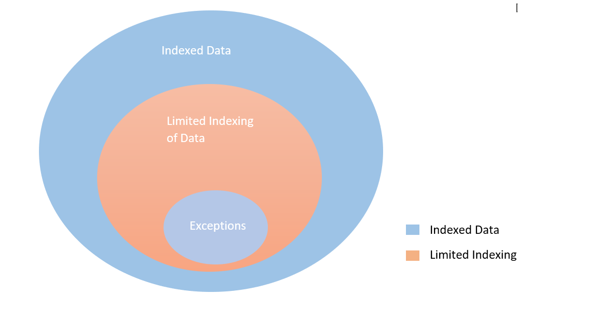

<!---Previous ms.author: rusamai --->

# 檔案共用Graph連接器

檔案共用Graph連接器可讓組織中的使用者搜尋內部部署Windows檔案共用。

> [!NOTE]
> 請閱讀 [**Graph連接器**](configure-connector.md)的安裝程式一文，以瞭解一般Graph連接器設定程式。

## 開始之前

### 安裝Graph連接器代理程式

若要為Windows檔案共用編制索引，您必須安裝並註冊Graph連接器代理程式。 若要深入瞭解，請參閱[安裝Graph連接器代理](graph-connector-agent.md)程式。  

### 內容需求

### 檔案類型

下列格式的內容可以編制索引並搜尋：DOC、DOCM、DOCX、 DOT、DOTX、EML、GIF、HTML、JPEG、MHT、MHTML、MSG、NWS、OBD、OBT、ODP、ODS、ODT、ONE、PDF、POT、PPS、PPT、PPTM、PPTX、TXT、XLB、XLC、XLSB、XLS、XLSX、XLT、XLXM、XML、XPS 和 ZIP。 只會編制這些格式的文字內容索引。 所有多媒體內容都會被忽略。 對於不屬於此格式的任何檔案，則會單獨編制中繼資料的索引。

### 檔案大小限制

支援的檔案大小上限為 100 MB。 超過 100 MB 的檔案不會編制索引。 後續處理的大小上限為 4 MB。 當檔案的大小達到 4 MB 時，處理就會停止。 因此，檔案中的某些片語可能無法用於搜尋。

## 步驟 1：在 Microsoft 365 系統管理中心 中新增Graph連接器

請遵循一般 [設定指示](./configure-connector.md)。
<!---If the above phrase does not apply, delete it and insert specific details for your data source that are different from general setup instructions.-->

## 步驟 2：命名連線

請遵循一般 [設定指示](./configure-connector.md)。
<!---If the above phrase does not apply, delete it and insert specific details for your data source that are different from general setup instructions.-->

## 步驟 3：設定連線設定

> [!NOTE]
> 您最多可以在單一連接中編制最多二十個不同檔案共用的索引。 在 [檔案共用] 文字方塊區域中，每行輸入一個檔案共用。

在 **[連線至資料來源**] 頁面上，選取 **[檔案共用**]，並提供名稱、連線識別碼和描述。 在下一個頁面上，提供檔案共用的路徑，然後選取先前安裝Graph連接器代理程式。 輸入具有檔案共用中所有檔案讀取權限的[Microsoft Windows](https://microsoft.com/windows)使用者帳號憑證。

### 保留上次存取時間

當連接器嘗試編目檔案時，其中繼資料中的「上次存取時間」欄位會更新。 如果您依賴該欄位來進行任何封存和備份解決方案，而不想在連接器存取時加以更新，您可以在 [進階 **設定** ] 頁面中設定此選項。

## 步驟 4：檔案索引的限制

設定檔案共用連線時，系統管理員可以限制檔案和資料夾的索引編制。 有多種方式可以執行此動作：

#### 根據檔案類型

只有這些格式的文字內容會編制索引：DOC、 DOCM、DOCX、DOT、DOTX、EML、HTML、MHT、MHTML、MSG、NWS、OBD、OBT、ODP、ODS、ODT、ONE、PDF、POT、PPS、PPT、PPTM、PPTX、TXT、XLB、XLC、XLSB、XLS、XLSX、XLT、XLXM、XML、XPS。 對於不屬於此格式的多媒體檔案和檔案，唯一的中繼資料會編制索引。

#### 根據上次修改後的上次修改日期或天數

#### 檔案/資料夾或正則運算式的完整網路路徑，以限制索引編制 

在網路路徑中，使用逸出字元 (\\) 特殊字元之前，例如 \\ 。 範例：針對路徑 \\ CONTOSOFILESHAREDFOLDER \\ \\ ，正確的輸入方式為 \\ \\ \\ \\ CONTOSOFILESHAREDFOLDER \\ \\ \\ \\ \\

您可以 [在這裡](/dotnet/standard/base-types/regular-expression-language-quick-reference)找到撰寫正則運算式的規則。

系統管理員也可以提供限制規則的例外狀況。 例外狀況規則的優先順序將會取代限制規則。 以類似的方式，可以為要包含在索引中的專案提供資料夾/檔案路徑來定義例外狀況。

## 步驟 5：管理搜尋許可權

您可以在 [管理搜尋許可權] 頁面中選取所需的選項，以根據 [共用存取控制清單] 或 [新技術檔案系統] (NTFS) 存取控制 清單來限制搜尋任何檔案 **的** 許可權。 這些存取控制清單中提供的使用者帳戶和群組必須由 Active Directory (AD) 管理。 如果您使用任何其他系統來管理使用者帳戶，您可以選取 [所有人] 選項，讓使用者在沒有任何存取限制的情況下搜尋所有檔案。 不過，當使用者嘗試開啟檔案時，會套用在來源設定的存取控制。

請注意，當網路上共用資料夾時，Windows 預設會提供共用 ACL 中「每個人」的「讀取」許可權。 根據延伸模組，如果您在 **[管理搜尋** 許可權] 中選擇 [共用 ACL]，使用者將能夠搜尋所有檔案。 如果您想要限制存取權，請移除檔案共用中「所有人」的「讀取」存取權，並只提供所需使用者和群組的存取權。 連接器接著會讀取這些存取限制，並將其套用至搜尋。

只有在您提供的共用路徑遵循 UNC 路徑格式時，才能選擇 [共用 ACL]。 您可以移至 [共用] 選項下的 [進階共用]，以 UNC 格式建立路徑。

:::image type="content" source="media/file-connector/file-advanced-sharing.png" alt-text="進階共用。" lightbox="media/file-connector/file-advanced-sharing.png":::

## 步驟 6：指派屬性標籤

請遵循一般 [設定指示](./configure-connector.md)。
<!---If the above phrase does not apply, delete it and insert specific details for your data source that are different from general setup instructions.-->

## 步驟 7：管理架構

請遵循一般 [設定指示](./configure-connector.md)。
<!---If the above phrase does not apply, delete it and insert specific details for your data source that are different from general setup instructions.-->

## 步驟 8：選擇重新整理設定

請遵循一般 [設定指示](./configure-connector.md)。
<!---If the above phrase does not apply, delete it and insert specific details for your data source that are different from general setup instructions.-->

## 步驟 9：檢閱連線

請遵循一般 [設定指示](./configure-connector.md)。
<!---If the above phrase does not apply, delete it and insert specific details for your data source that are different from general setup 
instructions.-->

<!---## Troubleshooting-->
<!---Insert troubleshooting recommendations for this data source-->

<!---## Limitations-->
<!---Insert limitations for this data source-->
