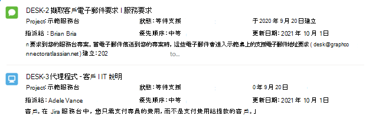

# <a name="result-layout-for-jira-graph-connector"></a>Jira Graph 連接器的結果配置

[Atlassian Jira Graph連接器](jira-connector.md)可讓您的組織為 Jira 問題編制索引。 從 Jira 網站設定連接器和索引內容之後，您必須設定搜尋結果頁面。

若要設定搜尋結果頁面，您需要：
1. 設定 [垂直搜尋](manage-verticals.md)。
2. 設定 [搜尋結果類型](manage-result-types.md)。

在本檔中，我們提供了設定 Jira 連接器結果配置所需的範例結果配置 JSON。

## <a name="before-you-get-started"></a>開始之前

您必須已設定 Jira 圖形連接器。 若要依原樣取用範例結果配置 JSON，您必須選取下列屬性以使用所述 [的搜尋架構編制索](configure-connector.md)引。

> [!NOTE]
> * 預設會選取下列某些屬性
> * **需要擷取** 搜尋屬性，才能在搜尋結果範本中顯示內容。 屬性也可以有其他搜尋屬性。  

| 屬性	 | 需要搜尋架構屬性 |
| -------- | -------- |
| 標題 | 檢索 |
| 已更新 | 檢索 |
| IssueLink | 檢索 |
| 問題描述 | Content 屬性 |
| IssueStatus | 檢索 |
| IssueIconUrl | 檢索 |
| IssueType | 檢索 |
| ProjectName | 檢索 | 
| 建立時間 | 檢索 |
| AssigneeName | 檢索 |
| IssuePriority | 檢索 |

## <a name="result-layout"></a>結果配置

在此範例中，您的搜尋結果看起來會像這樣：



以下是配置的相關聯 JSON 檔案：


```json
{
    "type": "AdaptiveCard",
    "version": "1.3",
    "body": [
        {
            "type": "ColumnSet",
            "columns": [
                {
                    "type": "Column",
                    "width": "auto",
                    "items": [
                        {
                            "type": "Image",
                            "horizontalAlignment": "Center",
                            "size": "Small",
                            "url": "${IssueIconUrl}",
                            "altText": "${IssueType}"
                        }
                    ],
                    "horizontalAlignment": "Center"
                },
                {
                    "type": "Column",
                    "width": "stretch",
                    "items": [
                        {
                            "type": "ColumnSet",
                            "spacing": "Small",
                            "columns": [
                                {
                                    "type": "Column",
                                    "width": "stretch",
                                    "items": [
                                        {
                                            "type": "TextBlock",
                                            "text": "[${Title} | ${IssueType}](${IssueLink})",
                                            "wrap": true,
                                            "maxLines": 1,
                                            "size": "Medium",
                                            "weight": "Bolder",
                                            "color": "Accent"
                                        }
                                    ]
                                }
                            ]
                        },
                        {
                            "type": "Container",
                            "items": [
                                {
                                    "type": "ColumnSet",
                                    "columns": [
                                        {
                                            "type": "Column",
                                            "width": "stretch",
                                            "items": [
                                                {
                                                    "type": "TextBlock",
                                                    "wrap": true,
                                                    "maxLines": 1,
                                                    "text": "Project : __${ProjectName}__"
                                                }
                                            ]
                                        },
                                        {
                                            "type": "Column",
                                            "width": "stretch",
                                            "items": [
                                                {
                                                    "type": "TextBlock",
                                                    "text": "Status : __${IssueStatus}__",
                                                    "wrap": true,
                                                    "maxLines": 1
                                                }
                                            ]
                                        },
                                        {
                                            "type": "Column",
                                            "width": "stretch",
                                            "items": [
                                                {
                                                    "type": "TextBlock",
                                                    "text": "Created : __{{DATE(${Created}, COMPACT)}}__",
                                                    "wrap": true,
                                                    "maxLines": 1
                                                }
                                            ]
                                        }
                                    ]
                                },
                                {
                                    "type": "ColumnSet",
                                    "columns": [
                                        {
                                            "type": "Column",
                                            "width": "stretch",
                                            "items": [
                                                {
                                                    "type": "TextBlock",
                                                    "text": "Assigned To : __${AssigneeName}__",
                                                    "wrap": true,
                                                    "maxLines": 1
                                                }
                                            ]
                                        },
                                        {
                                            "type": "Column",
                                            "width": "stretch",
                                            "items": [
                                                {
                                                    "type": "TextBlock",
                                                    "text": "Priority : __${IssuePriority}__",
                                                    "wrap": true,
                                                    "maxLines": 1
                                                }
                                            ]
                                        },
                                        {
                                            "type": "Column",
                                            "width": "stretch",
                                            "items": [
                                                {
                                                    "type": "TextBlock",
                                                    "text": "Updated : __{{DATE(${Updated}, COMPACT)}}__",
                                                    "wrap": true,
                                                    "maxLines": 1
                                                }
                                            ]
                                        }
                                    ]
                                }
                            ],
                            "spacing": "Small"
                        },
                        {
                            "type": "TextBlock",
                            "text": "${ResultSnippet}",
                            "maxLines": 2,
                            "wrap": true,
                            "spacing": "Small"
                        }
                    ],
                    "spacing": "Medium"
                }
            ]
        }
    ],
    "$schema": "http://adaptivecards.io/schemas/adaptive-card.json",
    "$data": {
        "IssuePriority": "Medium",
        "AssigneeName": "Brian Johnson",
        "ProjectName": "Demo service desk",
        "IssueStatus": "Waiting for support",
        "ResultSnippet": "Requests are like emails from your customers asking for help. Like email, you can respond to the reporter and add attachments.",
        "IssueType": "Bug",
        "Created": "2020-09-20T13:57:06Z",
        "Updated": "2021-06-05T04:36:03Z",
        "Title": "DESK-1 What is a request?",
        "IssueLink": "https://example.atlassian.net/browse/DESK-1"
    }
}
```
## <a name="resources"></a>資源

[自訂搜尋結果頁面](customize-search-page.md)

[管理搜尋結果版面配置](customize-results-layout.md)
