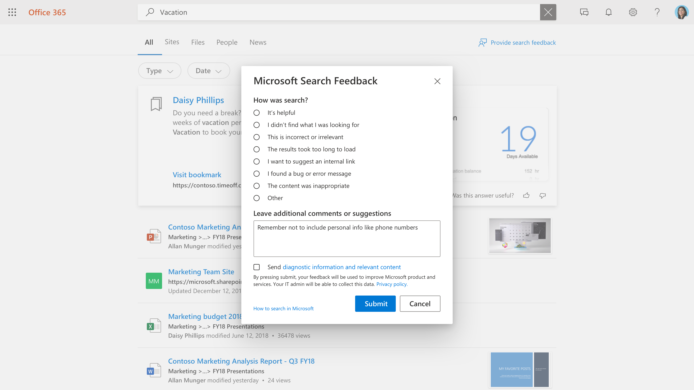

# 管理使用者意見反應

為您的使用者建立絕佳的搜尋體驗是 Microsoft 與搜尋系統管理員之間的合作關係。 使用者的意見反應可讓我們持續評估產品，並加以微調以獲得最佳體驗。 不過，您最適合處理一些意見反應。

我們現在提供工具，可讓您檢閱和管理使用者在搜尋體驗上提供的意見反應。

## 使用者如何提交意見反應

當貴組織中的人員使用Microsoft 搜尋時，他們可能會對體驗有意見反應。 當他們按一下結果頁面上的意見反應連結時，可以將其意見反應分類，並包含其他批註。

使用者也可以選擇將其查詢和其他診斷資訊，以及類別和批註傳送給 Microsoft。 [深入瞭解](https://privacy.microsoft.com/en-US/privacystatement) 隱私權，以及我們如何保護此資料。 診斷資料包含 Microsoft 需要使用意見反應專案進行產品改進的最重要資訊。

大部分的意見反應提交都會出現在Microsoft 搜尋系統管理中心的 [[意見](https://admin.microsoft.com/Adminportal/Home#/MicrosoftSearch/feedback)反應] 區段中。 使用 **[我想要建議內部連結** ] 類別目錄傳送的意見反應會在 [ [書簽](https://admin-ignite.microsoft.com/Adminportal/Home#/MicrosoftSearch/bookmarks) ] 區段中顯示為建議的書簽，並可藉由篩選 [ **建議** 的狀態] 來查看。

## 檢閱意見反應

在 [ [意見反應](https://admin.microsoft.com/Adminportal/Home#/MicrosoftSearch/feedback) ] 頁面上，您可以檢閱和匯出組織中人員在過去 30 天內傳送的意見反應。 一旦使用者提交意見反應，它就會在 20 分鐘內出現在這份清單中。 您可以使用 [重新整理] 按鈕來確保您正在查看最新的資料

藉由使用篩選，您可以看到特定答案類型的意見反應。 您也可以依來源和日期範圍進行篩選。

您可以使用意見反應清單上方的搜尋方塊來搜尋特定查詢的意見反應。

在意見反應清單中，[逐字] 資料行會指出使用者的意見反應也包含批註或建議。 若要讀取，請按一下查詢以開啟 **[詳細資料** ] 面板。

## 更新意見反應狀態

當意見反應傳入時，它會處於 *新* 狀態，並會保留在該處，直到您將其變更為 *[已解決* ] 或 *[重複]*。

若要變更此狀態：

1. 在查詢旁邊，選取 [ **其他選項** (三個垂直點) 。
1. 在功能表上，選取 **[標示為已解決]** 或 **[標示為重複]。**
1. 清單將會重新整理並顯示更新的狀態。

您也可以更新多個專案的狀態，只要選取它們，然後選取其中任何一個專案旁邊的 [更多選項]。

## 匯出意見反應

如果您想要與其他人分享搜尋意見反應，或保留超過 30 天，請按一下 [ **匯出]。** 系統會自動下載名為 Feedbacks 且日期為 "Feedbacks_10_31_2020.csv" 的.csv檔案。

## 將使用者意見反應傳送給 Microsoft

根據預設，除了您之外，所有使用者意見反應都會傳送給 Microsoft。 若要停止傳送意見反應給 Microsoft，請按一下 [ **管理設定**]，然後清除 [ **自動傳送使用者意見反應給 Microsoft** ] 核取方塊。 此變更最多可能需要 24 小時才會生效。

如果您已決定不自動將意見反應傳送給 Microsoft，您仍然可以將個別的意見反應傳送給 Microsoft。

1. 選取您想要分享的意見反應。
1. 在動作列中，選取 [更多 (三個點) ，然後按一下 [ **將意見反應傳送給 Microsoft]**。

1. [傳送至 Microsoft] 資料行中的狀態會變更為 [擱置中]。 傳送意見反應時，會變更為 [是]。

如果您自動或手動共用意見反應，它永遠不會包含選擇不包含此資訊之使用者的查詢和其他診斷資訊。

## 如何使用意見反應的建議

身為搜尋系統管理員，您應該瞭解組織中的主要角色，以及這些人員通常會與哪些類型的內容互動及搜尋。 透過這項瞭解，您可以使用意見反應來針對使用者的搜尋體驗進行目標改進。

1. 「我找不到我所尋找的內容」，類似的意見反應可用來識別使用者想要的內容，但目前並未包含在搜尋索引中。 判斷這通常會根據瞭解您的使用者來進行調查和推斷。 找到後，決定包含該內容最適合的方法：
    1. 書簽適用于具有高品質登陸頁面和有限搜尋字詞種類的內容來源，讓使用者社群從書簽取得高品質的結果，然後可以有效率地找到他們要尋找的內容。
    1. Q&A 對於相當頻繁但不會變更的個別解答很有用。
    1. 連接器適用于具有各種內容和各種搜尋字詞的內容來源。
1. 「結果載入時間太長」&「我發現問題」可能是更廣泛問題的指標。 每天尋找此意見反應可能會有説明，如果出現多個案例，您可以自行確認搜尋體驗，並視需要向 Microsoft 提出支援案例。 這種類型的意見反應對 Microsoft 也很重要，也是將所有意見反應傳送給我們的絕佳理由。
1. 「我想要建議內部連結」可以評估為新增為書簽或已連線的內容。 您的第一個想法應該是書簽;如果書簽的使用量很高，您可以考慮透過連接器帶入內容，以提供更豐富的搜尋體驗。
