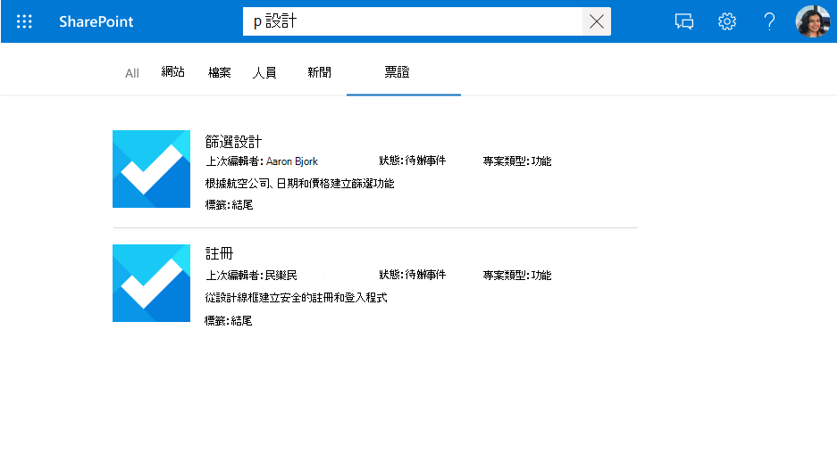
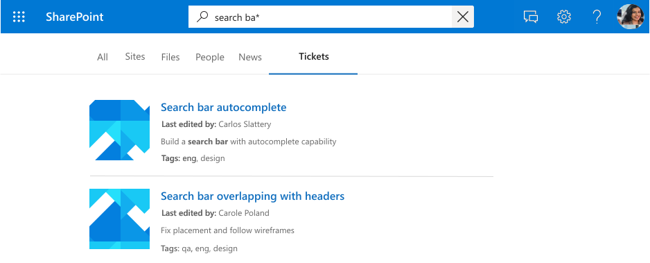
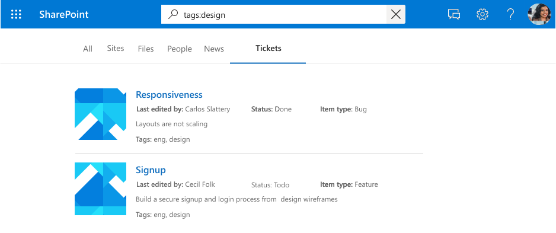
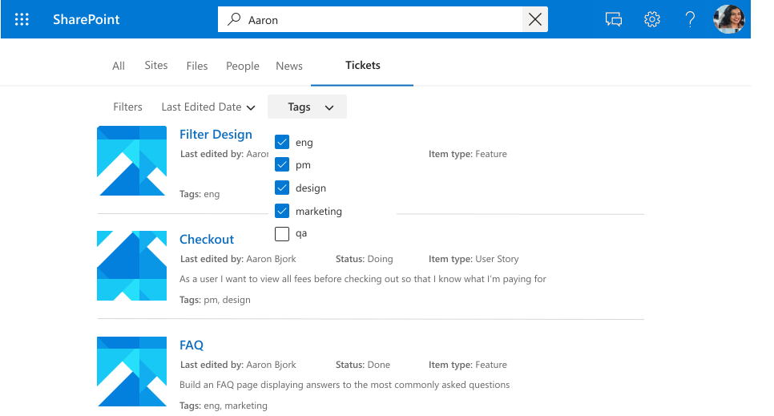

# 管理搜尋架構 (預覽) 

搜尋架構會決定透過 Graph 連接器擷取內容的方式，在各種 Microsoft Graph 體驗中使用。 架構會定義如何從資料來源收集、編制索引、查詢及從搜尋索引擷取內容的結構。 藉由變更搜尋架構，您可以控制使用者可以搜尋的內容、使用者搜尋的方式，以及如何在 Microsoft Search 端點上呈現結果。

搜尋架構包含編目屬性、搜尋屬性、語意標籤和別名。 下一節將定義所提供架構和管理功能的各種組成者。

> [!NOTE]
> * 請閱讀 [**設定 Graph 連接器**](configure-connector.md) 一文，以瞭解一般 Graph 連接器設定指示。 步驟 6 和 7 會在設定新連線時定義架構。

## 編目屬性

為了建立搜尋索引，必須先編目內容。 您可以編目連接 [器](connectors-gallery.md)資源庫中所列的各種內容來源。 編目專案的內容和中繼資料會以編目屬性工作表示， (或來源屬性) 。

例如，下表顯示工作票證系統連接器的範例編目屬性。

| 屬性	       | 類型             |
|----------------|------------------|
| ticketId       | 字串           |
| 標題          | String           |
| createdBy      | 字串           |
| assignedTo     | 字串           |
| lastEditedDate | 日期時間         |
| lastEditedBy   | 字串           |
| workItemType   | 字串           |
| 優先       | Int64            |
| 標籤           | StringCollection |
| 地位         | 字串           |
| URL            | 字串           |
| 解決       | 布林值          |

> [!NOTE]
> * 針對 Microsoft 建置的連接器，編目屬性會在 [**設定 Graph 連接器**](configure-connector.md) 一文的步驟 4 中選取。

## 搜尋屬性

### Content 屬性

此屬性用於內容的全文檢索索引、搜尋結果頁面程式碼片段產生、 [結果叢集](result-cluster.md) 參與、語言偵測、HTML/文字支援、排名和相關性，以及查詢公式。

如果您選取內容屬性，當您 [建立結果類型](customize-results-layout.md)時，可以選擇使用系統產生的屬性 **ResultSnippet**。 這個屬性可做為查詢時從 content 屬性產生的動態程式碼片段的預留位置。 如果您在結果類型中使用此屬性，則會在搜尋結果中產生程式碼片段。

### 可搜尋

如果屬性是可搜尋的，則其值會新增至全文檢索索引。 當使用者執行搜尋時，如果其中一個可搜尋的欄位或其內容發生搜尋叫用，則會傳回結果。

*搜尋「設計」，顯示內容 () `title` 和內容的點擊結果。*

### 可查詢

如果屬性是可查詢的，您可以使用知識查詢語言 (KQL) 進行查詢。 KQL 包含一或多個可用的文字關鍵字， (單字或片語) 或屬性限制。 屬性名稱必須包含在查詢中，在查詢本身中指定，或以程式設計方式包含在查詢中。 您可以使用前置詞比對搭配萬用字元運算子 (*) 。

> [!NOTE]
> 不支援尾碼比對。

*搜尋 「search ba \* 」，其中顯示符合此前置詞的結果。*

*搜尋 「tags：design」 時，會將結果範圍縮小至 屬性中 `tags` 具有 「design」 的專案。*

### 可擷取

如果可擷取屬性，則可以在搜尋結果中傳回其值。 您想要在顯示範本中新增或從查詢傳回且與搜尋結果相關的任何屬性都必須是可擷取的。 將大型或太多屬性標示為可擷取會增加搜尋延遲。 選擇性並選擇相關的屬性。

*一組可擷取的屬性 (`title` 並 `lastEditedBy`) 轉譯為結果。*

### 可精簡搜尋

如果屬性是可精簡的，系統管理員可以在 Microsoft Search 結果頁面中將它設定為自訂篩選。 屬性 `refinable` 不可以是 `searchable` 。

*依 `tags` 精簡結果，這是可精簡的屬性。*

> [!NOTE]
> * 針對 Microsoft 建置的連接器，會在 [**設定 Graph 連接器**](configure-connector.md) 一文的步驟 7 中選取搜尋屬性。

## 語意標籤

語意標籤是由 Microsoft 發佈的已知標籤，您可以針對架構中的屬性新增。 新增語意標籤可協助各種 Microsoft 產品瞭解 屬性，並提供更好的體驗。

語意標籤提供與網域無關的方法，可將不同內容網域的屬性指派給一組已知類別。 他們會在許多不同的內容體驗中尋找應用程式，並為工作提供自動化支援，例如：

* 異質體驗中的資料整合
* 建置通用知識圖表 (例如，Viva Topics) 
* 使用者體驗的預設範本

標籤提供語意意義，並可讓您將連接器資料整合到 Microsoft 365 體驗中。  

| 標籤                 | 描述                                                                               |
|---------------------- |------------------------------------------------------------------------------------------ |
| 標題                 | 您想要在搜尋和其他體驗中顯示的專案標題。                |
| URL                   | 資料來源中專案的目標 URL。                                            |
| createdBy             | 在資料來源中建立專案的人員名稱。                           |
| lastModifiedBy        | 最近編輯資料來源中專案之人員的名稱。              |
| 作者               | 在資料來源中參與/共同作業專案的所有人員名稱。 |
| createdDateTime       | 專案在資料來源中建立的日期和時間。                           |
| lastModifiedDateTime  | 上次在資料來源中修改專案的日期和時間。                     |
| 檔案名              | 如果是檔案，則為數據源中的檔案名。                               |
| fileExtension         | 如果是檔案，則為數據源中檔案的副檔名。                          |
| iconUrl               | 圖示的 URL。                                                                       |

例如，編目屬性 **lastEditedBy** 與 Microsoft 標籤 *lastModifiedBy* 具有相同的意義。

> [!IMPORTANT]
> 您對應至標籤的所有屬性都必須是可擷取的。

標籤 **標題** 是最重要的標籤。 請確定您將屬性指派給此標籤，以允許您的連線參與結果叢集體驗。 不正確地對應標籤會降低搜尋體驗。 某些標籤沒有指派屬性是沒關係的。

> [!NOTE]
> * 針對 Microsoft 建置的連接器，系統會在 [**設定 Graph 連接器**](configure-connector.md) 一文的步驟 6 中選取語意標籤。

## 別名

別名是您指派之屬性的易記名稱。 這些會用於可精簡屬性篩選中的查詢和選取專案。

> [!NOTE]
> * 針對 Microsoft 建置的連接器，別名會在 [**設定 Graph 連接器**](configure-connector.md) 一文的步驟 7 中定義。

## 架構更新功能

本節包含 Microsoft 建置 Graph 連接器之搜尋架構的更新功能相關資訊。

> [!NOTE]
> 建議您在更新之後執行完整編目，以將它們帶入最新的架構。 如果沒有完整編目，專案的行為將會不一致。

### 管理結構描述

1. 在 [Microsoft 365 系統管理中心](https://admin.microsoft.com)中，移至 [**自訂**] 區段中的 [架 [**構**](https://admin.microsoft.com/Adminportal/Home#/MicrosoftSearch/schema)] 頁面。
2. 按一下 **[圖形連接器架構**] 底下的 [檢 **視詳細** 資料]。
3. 選取您要更新架構的連線，然後按一下 **[自訂架構]**。
4. 進行必要的架構變更之後，按一下 [ **發佈架構變更** ] 以發佈新的架構。

### 新增編目屬性

您可以將屬性新增至架構。 當您新增屬性時，可以包含您需要的所有搜尋屬性。

*從連接器支援的屬性清單中新增來源屬性*

> [!IMPORTANT]
> 
> 您無法刪除已發佈連線的現有屬性。 若要移除屬性，您必須刪除並重新建立連線。

### 新增/移除搜尋功能

您可以新增或移除屬性的特定搜尋屬性。 新增搜尋功能需要完整編目。

*更新編目屬性的搜尋批註*

> [!IMPORTANT]
> * 您無法從屬性中移除可擷取的搜尋屬性。
> * 您無法新增或移除屬性的可精簡搜尋屬性。

### 新增/移除語意標籤

您可以新增或更新編目屬性的語意標籤對應。

*更新編目屬性的語意標籤*

### 新增/移除別名

您可以新增或移除別名，並將其用於搜尋查詢。

*新增或移除編目屬性的別名*

<!---## Troubleshooting-->
<!---Insert troubleshooting recommendations-->

<!---## Limitations-->
<!---Insert limitations for this feature-->
