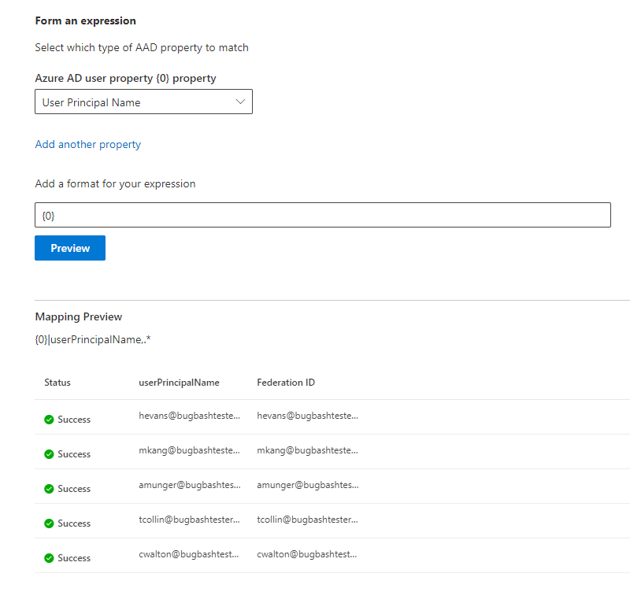

# 對應您的 Azure AD 身分識別  

本文將逐步引導您將 Azure AD 身分識別對應至資料來源的唯一識別碼， (非 Azure AD 身分識別) ，讓存取控制清單 (具有非 Azure AD 身分識別的 ACL) 中的人員可以看到其範圍的連接器搜尋結果。

這些步驟只與由 Microsoft 設定[Salesforce](salesforce-connector.md)連接器的搜尋系統管理員有關，且其具有「僅限具有此資料來源存取權的人員」和身分識別類型 「AAD」 的搜尋許可權。 下列步驟會逐步引導您將 Azure AD 使用者屬性對應至使用者的 **同盟識別碼**。

>[!NOTE]
>如果您要設定 [Salesforce連接器](salesforce-connector.md)，並在搜尋許可權畫面上選取 [**只有具有此資料來源存取權的人員** 和 **非 AAD** 的身分識別類型] ，請參閱對應 [您的非 Azure AD](map-non-aad.md)身分識別一文，以取得如何對應非 Azure AD 身分識別的步驟。  

## 對應 Azure AD 屬性的步驟

### 1.選取要對應的 Azure AD 使用者屬性

您可以選取對應至同盟識別碼所需的 Azure AD 屬性。

您可以從下拉式清單中選取 Azure AD 使用者屬性。 如果需要這些屬性才能為您的組織建立同盟識別碼對應，您也可以新增任意數量的 Azure AD 使用者屬性。

### 2.建立公式以完成對應

您可以合併 Azure AD 使用者屬性的值，以形成唯一的同盟識別碼。

在公式方塊中，「 {0} 」 會對應至您選取 *的第一個* Azure AD 屬性。 「 {1} 」 對應至您選取的第 *二* 個 Azure AD 屬性。 「 {2} 」 對應至 *第三* 個 Azure AD 屬性，依此類推。  

以下是一些具有範例正則運算式輸出和公式輸出的公式範例：

| 範例公式                  | 範例使用者的屬性 {0} 值                 | 範例使用者的屬性 {1} 值           | 公式的輸出                  |
| :------------------- | :------------------- |:---------------|:---------------|
| {0}.{1}@contoso.com  | firstname | 姓氏 |firstname.lastname@contoso.com
| {0}@domain.com                 | userid                 |             |userid@domain.com

提供公式之後，您可以選擇性地按一下 **[預覽** ]，查看資料來源中 5 個隨機使用者的預覽，並套用其各自的使用者對應。 預覽的輸出包含步驟 1 中為這些使用者選取的 Azure AD 使用者屬性值，以及該使用者在步驟 2 中所提供最終公式的輸出。 它也會指出公式的輸出是否可透過「成功」或「失敗」圖示解析為租使用者中的 Azure AD 使用者。  

>[!NOTE]
>如果按一下 [ **預覽**] 之後，一或多個使用者對應具有「失敗」狀態，您仍然可以繼續建立連線。 預覽會顯示來自您資料來源的 5 個隨機使用者及其對應。 如果您提供的對應並未對應所有使用者，您可能會遇到這種情況。

## Azure AD 對應範例

如需範例 Azure AD 對應，請參閱下列快照集。

## 限制  

- 所有使用者都只支援一個對應。 不支援條件式對應。  

- 發佈連線之後，您就無法變更對應。  

- Azure AD 到同盟識別碼轉換不支援針對 Azure AD 使用者屬性的 Regex 型運算式。