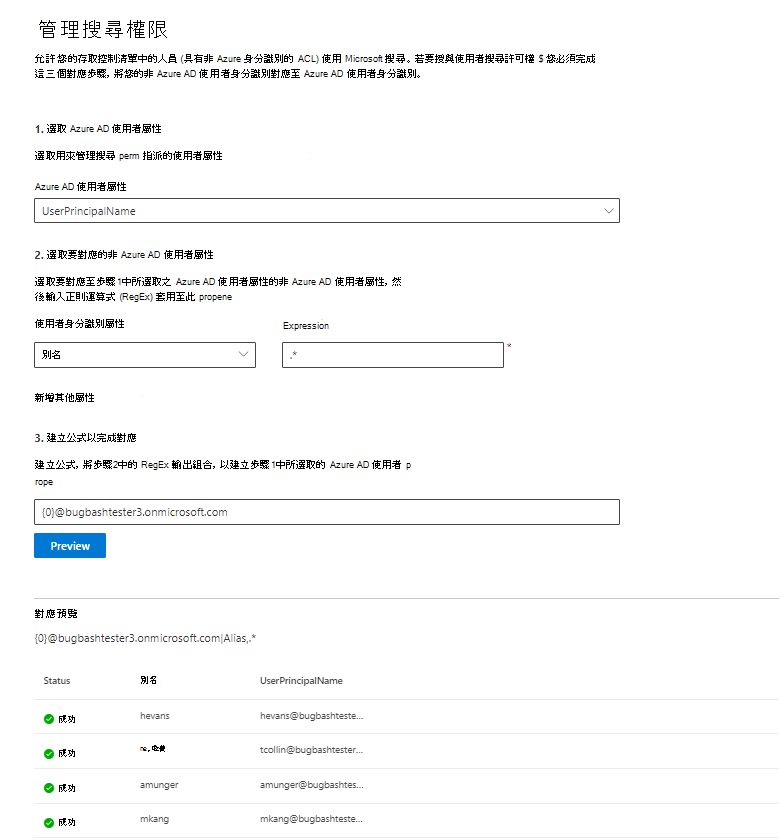

# 對應您的非 Azure AD 身分識別  

本文將逐步引導您將非 Azure AD 身分識別對應至您的 Azure AD 身分識別，讓存取控制清單中的人員 (具有非 Azure AD 身分識別的 ACL) 可以看到其範圍的連接器搜尋結果。

這些步驟只與設定[Confluence Cloud](confluence-cloud-connector.md)、[Confluence On-premises](confluence-onpremises-connector.md)、[ServiceNow Knowledge](servicenow-knowledge-connector.md)、[ServiceNow Catalog](servicenow-catalog-connector.md)或[Salesforce](salesforce-connector.md)連接器的搜尋系統管理員相關，Microsoft 具有「僅限具有此資料來源存取權的人員」和身分識別類型「非 AAD」的搜尋許可權。

>[!NOTE]
>如果您要設定Salesforce連接器，並在搜尋許可權畫面上選取 [**只有具有此資料來源存取權的人員** 和身分識別類型 **AAD**]，請參閱對應 [您的 Azure AD](map-aad.md)身分識別一文，以取得如何對應 Azure AD 身分識別的步驟。  

## 對應非 Azure AD 屬性的步驟

### 1.選取 Azure AD 使用者屬性  

您可以選取您要建立對應的 Azure AD 使用者屬性。 這是您想要對應非 Azure AD 身分識別的目標屬性。  

您可以選取下列其中一個 Azure AD 屬性：

| Azure AD 屬性    | 定義           | 範例         |
| :------------------- | :------------------- |:--------------- |
| 使用者主體名稱 (UPN)  | UPN 包含 UPN 前置詞 (使用者帳戶名稱) 和 UPN 尾碼 (DNS 功能變數名稱) 。 前置詞會使用 「@」 符號與 後置詞聯結。 | us1@contoso.onmicrosoft.com |
| Azure AD 識別碼                 | 指定使用者的 Azure AD 識別碼是使用者的唯一 GUID。                 | 58006c96-9e6e-45ea-8c88-4a56851eefad            |
| SID (Active Directory 安全性識別碼)                   | SID (安全識別碼) 是 Active Directory 用來將物件識別為安全性主體的唯一識別碼。                  | S-1-5-21-453406510-812318184-4183662089             |

### 2.選取要對應的非 Azure AD 使用者屬性

您可以選取從資料來源提取的非 Azure AD 屬性，以套用正則運算式。 若要深入瞭解如何在您的資料來源中找到這些屬性，請參閱[Confluence Cloud](confluence-cloud-connector.md)、[Confluence 內部](confluence-onpremises-connector.md)部署、[ServiceNow 知識](servicenow-knowledge-connector.md)、[ServiceNow 目錄](servicenow-catalog-connector.md)和[Salesforce](salesforce-connector.md)頁面。  

您可以從下拉式清單中選取非 Azure AD 使用者屬性，並提供要套用在這些使用者屬性值上的正則運算式。

以下是一些正則運算式範例及其套用至範例字串的輸出： 

| 字串範例                  | 規則運算式                 | 範例字串上正則運算式的輸出           |
| :------------------- | :------------------- |:---------------|
| Alexis Vasquez  | .* | Alexis Vasquez |
| Alexis Vasquez                 | ..$                 | Ez            |
| Alexis Vasquez                  |  (\w+) $                  | Vasquez             |

您可以新增與運算式一樣多的非 Azure AD 使用者屬性。 如果您的最終公式保證，您可以將不同的正則運算式套用至相同的使用者屬性。  

### 3.建立公式以完成對應

您可以結合套用至每個非 Azure AD 使用者屬性的正則運算式輸出，以形成步驟 1 中選取的 Azure AD 屬性。

在公式方塊中，「 {0} 」 會對應至套用至您選取 *之第一* 個非 Azure AD 屬性的正則運算式輸出。 「 {1} 」 對應至套用至您選取的第 *二* 個非 Azure AD 屬性的正則運算式輸出。 「 {2} 」 對應至套用至 *第三* 個非 Azure AD 屬性的正則運算式輸出，依此類推。  

以下是一些具有範例正則運算式輸出和公式輸出的公式範例： 

| 範例公式                  | 範例使用者上的 {0} 值                 | 範例使用者上的 {1} 值           | 公式的輸出                  |
| :------------------- | :------------------- |:---------------|:---------------|
| {0}.{1}@contoso.com  | firstname | 姓氏 |firstname.lastname@contoso.com
| {0}@domain.com                 | userid                 |             |userid@domain.com

提供公式之後，您可以選擇性地按一下 **[預覽** ]，查看資料來源中 5 個隨機使用者的預覽，並套用其各自的使用者對應。 預覽的輸出包含步驟 2 中為這些使用者選取的非 Azure AD 使用者屬性值，以及步驟 3 中為該使用者提供的最終公式輸出。 它也會指出公式的輸出是否可透過「成功」或「失敗」圖示解析為租使用者中的 Azure AD 使用者。  

>[!NOTE]
>如果按一下 [ **預覽**] 之後，一或多個使用者對應具有「失敗」狀態，您仍然可以繼續建立連線。 預覽會顯示來自您資料來源的 5 個隨機使用者及其對應。 如果您提供的對應並未對應所有使用者，您可能會遇到這種情況。

## 非 Azure AD 對應範例

如需非 Azure AD 對應的範例，請參閱下列快照集。

## 限制  

- 所有使用者都只支援一個對應。 不支援條件式對應。  

- 發佈連線之後，您就無法變更對應。  

- 轉換目前僅支援針對非 AAD 使用者屬性的 RegEx 型運算式。

- 只有 3 個 Azure AD 身分識別可供您選擇對應至 (UPN、Azure AD 識別碼和 AD SID) 。