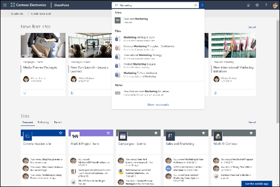
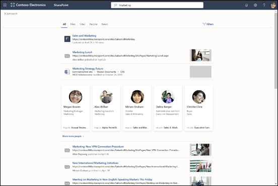

# Microsoft 搜尋概觀

Microsoft 搜尋可協助您找出完成所用專案所需的工作。 不論您正在搜尋人員、檔案、組織結構圖、網站或解答常見問題，您都可以在整個 workday 中使用 Microsoft 搜尋，以取得答案。

Microsoft 搜尋可協助使用者找出正確的答案、人員和內容，以在使用者已使用的應用程式中完成其工作。

- 使用者會收到他們從中搜尋的應用程式 **上下文** 中的相關結果。 例如，在[Microsoft Outlook](https://www.microsoft.com/outlook)中搜尋時，他們會發現電子郵件，而不是[SharePoint](http://sharepoint.com/)網站。 在 SharePoint 中搜尋時，他們會尋找網站、頁面和檔案時。
- 無論使用者使用哪個應用程式，Microsoft Search 都是 **個人** 的。 Microsoft 搜尋使用[Microsoft Graph](https://developer.microsoft.com/graph/)中的真知灼見，顯示與每位使用者相關的結果。 每個使用者可能會看到不同的結果，即使他們搜尋相同文字亦然。 他們只會看到他們已有權存取的結果，Microsoft 搜尋不會變更許可權。
- 在 [Bing](https://bing.com) 中時，使用者可以取得來自公用網站與來自其組織內的結果。

## 使用者看到的內容

在[Bing](https://bing.com)中，使用者會使用與 web 搜尋相同的搜尋方塊。 在 Office 應用程式中，使用者會在標題列中尋找 [Microsoft 搜尋] 方塊。 畫面顯示為這樣：

![使用標題列中 Microsoft 搜尋] 方塊的應用程式視窗的螢幕擷取畫面。](media/Headings_520.png)

當使用者在 **搜尋** 方塊中按一下時，搜尋會根據其在 Office 365 中的先前活動，並根據組織中的趨勢內容來建議結果。 搜尋會考慮活動，例如最近使用的檔案、最近使用的命令，以及共同合作的人員。 當使用者在 **搜尋** 方塊中開始輸入時，建議的結果更新。 使用者可以從 **搜尋** 方塊直接開啟搜尋結果。 以下是[SharePoint](http://sharepoint.com/)中的搜尋範例。

如果 [搜尋] 方塊中的建議不是使用者所尋找的，請 **輸入** 開啟完整的結果清單。 使用者可以使用中繼資料，例如上次修改專案的人員，以及專案的位置和位置，以判斷其是否為所要尋找的專案。

## Microsoft Search 的優點

**從任何 Microsoft Search 方塊跨 Microsoft 365 搜尋** - 使用者可以從任何 Microsoft Search 方塊搜尋，並快速回到他們執行的動作。 Microsoft 搜尋會從 Office 365 中的資料來源彙集結果，包括[SharePoint](http://sharepoint.com/)、 [Microsoft 商務用 OneDrive](https://onedrive.live.com/about/business/)及[Microsoft Exchange](https://products.office.com/exchange/microsoft-exchange-server)。

**易於搜尋**– Microsoft 搜尋會根據使用者在 Office 365 中的先前活動，在 **搜尋** 方塊中向右推薦結果。

**尋找共用的檔案** - Microsoft 搜尋使用進階查詢理解讓尋找共用檔案更容易。 使用者可以輕鬆地找到他們正在共同作業的檔案。

**顯示相關內容** - 提升您的使用者完成工作所需的資訊和解答，例如政策、福利、資源、工具等。 您也可以針對特定群組，例如新員工、遠端工作者或不同地理區域。

**跨所有應用程式管理** - Microsoft 搜尋預設為 **開啟**，並且您所做的任何系統管理會套用至所有應用程式中的 Microsoft 搜尋。

## 為您的組織打造 Microsoft Search

身為系統管理員，您可以為使用者創造令人驚奇的 Microsoft 搜尋體驗。

**顯示有用的內容** –答案會以關鍵字為基礎的搜尋查詢提供快速、授權的結果。 [規劃您的內容](plan-your-content.md)。

**新增外部內容**– Microsoft Graph 連接器可讓您將外部內容移至索引。 使用連接器，從 Microsoft 365 以外的資料和檔案豐富搜尋體驗。 [Microsoft Graph 連接器的概述](connectors-overview.md)

**自訂使用者經驗** –您可以使用縱向和其他設定自訂使用者經驗。 [自訂 Microsoft 搜尋頁面](customize-search-page.md)

## 搜尋的內容

Microsoft 搜尋會顯示您的組織已儲存在 Microsoft 365 中或已透過連接器編制索引的內容。 Microsoft 搜尋不會在承租人間搜尋，或顯示其他組織共用的內容結果。 如果您的組織已使用雲端混合式搜尋設定混合式 SharePoint 環境，Microsoft 搜尋會傳回線上和內部部署 SharePoint 內容的搜尋結果，包含您已連線到 SharePoint 伺服器環境的任何外部內容。 [深入了解混合式搜尋環境](/sharepoint/hybrid/learn-about-cloud-hybrid-search-for-sharepoint)。

使用者將取得從其他位置取得的相同搜尋結果，以及在 Bing 使用 Microsoft 搜尋時，也會取得來自網際網路的結果。

## Microsoft 搜尋的運作方式

當使用者搜尋時，Microsoft Search 會處理查詢，並從較大的片語剖析搜尋意圖，以使用人工智慧 (AI) 學習使用者新增到查詢，但不影響其搜尋意圖的常用多餘片語。 舉例來說，當使用者搜尋「如何變更我的密碼」，我們會截掉查詢中較不重要的字詞，並依據較相關的項目 (例如「變更密碼」) 來進行觸發。  
使用者有 **權限** 查看的搜尋結果會顯示在搜尋結果頁面上。 Microsoft Search 會依據相關性，使用智慧型排序演算法以排序結果。

## 隱私權

在 Microsoft 搜尋只有使用者有權查看的內容會出現在搜尋結果中。 例如，使用者可能具有查看檔案的許可權，因為使用者已建立該檔案，該檔案是與使用者共用，或具有包含使用者的較大群組，或是儲存在使用者有權存取的資料夾或位置。
> [!NOTE]
> 深入瞭解 Bing 中的 Microsoft 搜尋如何在[Bing 的 Microsoft 搜尋安全性和隱私權](security-for-search.md)中保護公司資料。

當人員在 SharePoint 中篩選人員時，會看到來自已篩選人員已進行的內容，以及他們具有查看許可權的結果。 如果已篩選的人員或其組織已在 Microsoft Graph 中關閉專案洞察力，則人員只會看到來自已篩選人員與其共用之內容的結果，或是來自其所處理的內容。 [深入瞭解專案真知灼見](/graph/item-insights-overview)。

當使用者在 Outlook 中取得搜尋的結果、SharePoint 線上及 Office .com 時，所發出的查詢會記錄在其搜尋記錄中。 使用者的搜尋記錄是個人的，不會與您的組織或 Microsoft 共用。 其搜尋記錄可協助他們快速取得先前找到的專案。 在使用者輸入查詢時，其搜尋記錄中的相符專案會在搜尋框中向下建議。  

使用者可以隨時查看其搜尋歷程記錄。 他們也可以隨時清除其歷程記錄。 這兩項動作都是由其工作或學校帳戶的 [我的帳戶入口網站](https://myaccount.microsoft.com) 執行。 移至[設定 & 隱私權] 頁面](https://myworkaccount.microsoft.com/privacy)上，開啟 [Microsoft 搜尋] 區段。 無法暫停記錄史。

Outlook 搜尋記錄會包含其在 Outlook、Outlook 的行動及 Outlook 網頁版的搜尋。 它會為所有三個端點提供相同的建議查詢。 在 SharePoint 網站上的搜尋、SharePoint 開始頁面上和 Office .com 首頁上會合並成一個記錄，並在 [SharePoint 開始] 頁面或 [Office .com] 首頁上搜尋時，會建議您回復相同的查詢。 當使用者在 SharePoint 網站上進行搜尋時，並不會提供歷史查詢。

當組織中的許多人員在 Outlook、SharePoint 和 Office 中搜尋相同的 Microsoft 搜尋內容時，您的系統管理員就能看到該查詢是常見的，但不是搜尋的使用者。 您可以使用此資訊來定義哪些資源是常見查詢的良好結果，並使您的組織更能進行搜尋。 深入瞭解在 [規劃內容](plan-your-content.md)時提供答案。

## 請參閱

[設定 Microsoft Search](setup-microsoft-search.md)
