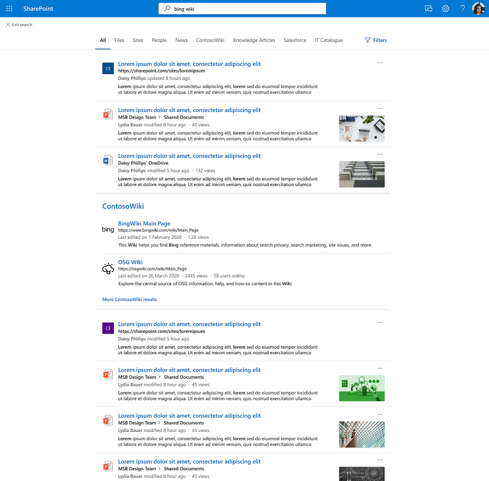

# Graph連接器結果叢集

## Graph連接器結果叢集的概觀  

透過Graph連接器結果叢集，您可以在 [**全部**] 索引標籤、SharePoint、Office.com 和 Bing 中 Microsoft 搜尋搜尋來自協力廠商資料來源的內容。

結果叢集可協助使用者在單一位置探索所有內容。 結果叢集中顯示的結果會根據搜尋垂直組態分組在一起。

## 如何選取和顯示連接器結果

連線的內容必須符合下列兩個準則，才能顯示在結果叢集中： 
1.  外部專案必須有足夠的資料內嵌到專案的 ["content" 屬性](/graph/api/resources/externalconnectors-externalitem?view=graph-rest-beta#properties) 中。
1.  其中一個來源屬性必須對應至[語意標籤 "title"。](configure-connector.md?#step-6-assign-property-labels)

結果叢集中提供的連接器結果來自具有連接器內容的個別搜尋垂直。 每個搜尋垂直都會提供一組相關結果，這些結果會成為候選結果叢集。 相關結果會根據與每個專案的「標題」和「內容」屬性重迭的查詢字詞來選擇。 

若要確保從搜尋垂直線探索內容，建議為您的專案提供有意義的標題。 這會正面影響結果叢集候選項目的仲裁，以及內容出現在結果叢集中的可能性。 例如，除非您的使用者使用識別碼來尋找內容，否則請避免使用識別碼作為屬性 "title" 的值。

顯示結果叢集的頻率取決於因素，例如您設定的搜尋垂直數目和內容類型。 藉由互動或忽略結果叢集，使用者會隱含地提供提示，以隨著時間調整其觸發。

結果叢集中顯示之連接器專案的搜尋結果體驗會使用您所定義 [的結果類型](./customize-search-page.md#create-your-own-result-type) 。 如果未設定任何結果類型，則會使用 [系統產生的版面配置](./customize-search-page.md#default-search-result-layout) 。

建議您使用 "title" 屬性作為搜尋結果標題，並使用 "content" 屬性作為搜尋描述。 這會透過精確觸發結果叢集和叢集中最相關的結果，為您的使用者提供最佳體驗。

結果叢集會顯示在頁面中間的 [全部] 垂直。 例如，下方顯示來自 'MediaWiki' 垂直的結果叢集。

## 結果叢集預設設定
  
預設會開啟結果叢集體驗。  

如果您想要停用它，請遵循下列步驟來關閉組織層級的體驗：

1. 在 [Microsoft 365 系統管理中心](https://admin.microsoft.com)中，移至 [**[垂直]**](https://admin.microsoft.com/Adminportal/Home#/MicrosoftSearch/verticals)。
1. 選取 **[全部** 垂直]，然後啟用 **[隱藏連接器結果]**。

請遵循下列步驟來關閉SharePoint月臺層級的體驗：

1. 移至 **SharePoint** 網站中的設定
2. 移至 **[網站資訊** > **][檢視所有網站設定]**。
3. 移至 [Microsoft 搜尋] 區段，然後選取 [設定 **此網站集合的Microsoft 搜尋]**。
4. 在流覽窗格中，移至 [ **自訂體驗]**，然後選取 [ **垂直]**。
5. 選取 **[全部** 垂直]，然後啟用 **[隱藏連接器結果]**。
