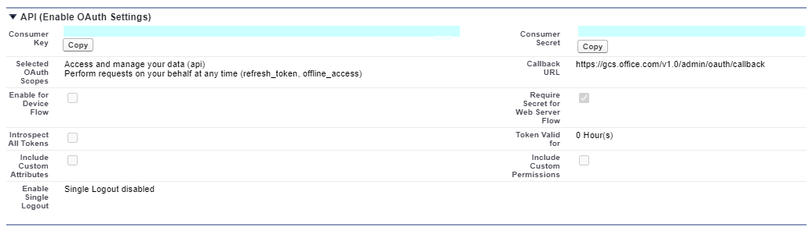
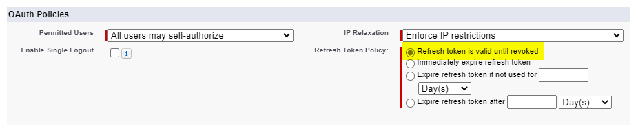

<!---Previous ms.author: rusamai --->

# Salesforce Microsoft Graph 連接器

Salesforce Microsoft Graph連接器，可讓您的組織為您Salesforce實例中的連絡人、商機、潛在客戶、案例和帳戶物件編制索引。 從Salesforce設定連接器和索引內容之後，使用者就可以從任何Microsoft 搜尋用戶端搜尋這些專案。

> [!NOTE]
> 請閱讀 [**Microsoft 365 系統管理中心文章中的設定 Microsoft Graph 連接器**](configure-connector.md)一文，以瞭解一般 Microsoft Graph 連接器設定指示。

本文適用于設定、執行及監視Salesforce連接器的任何人。 它會補充一般設定程式，並顯示僅適用于Salesforce連接器的指示。 本文也包含限制 [的相關](#limitations)資訊。

>[!IMPORTANT]
>Salesforce連接器目前支援「19 年或以後的月份」。

## 開始之前

若要連線到Salesforce實例，您需要Salesforce實例 URL、用戶端識別碼和用戶端密碼，才能進行 OAuth 驗證。 下列步驟說明您或Salesforce系統管理員如何從您的Salesforce帳戶取得此資訊：

- 登入您的Salesforce實例並移至安裝程式

- 流覽至 [應用程式- >應用程式管理員]。

- 選 **取 [新增已連線的應用程式]**。

- 完成 API 區段，如下所示：

    - 選取 [**啟用 Oauth 設定] 核取方塊**。

    - 將回呼 URL 指定為： [https://gcs.office.com/v1.0/admin/oauth/callback](https://gcs.office.com/v1.0/admin/oauth/callback)

    - 選取這些必要的 OAuth 範圍。

        - 存取和管理資料 (API) 

        - 在 (refresh_token時，隨時代表您執行要求，offline_access) 

    - 選取 [ **需要 Web 服務器流程的秘密] 核取方塊**。

    - 儲存應用程式。
    
      > [!div class="mx-imgBorder"]
      > 

- 複製取用者金鑰和取用者秘密。 當您在 Microsoft 365 管理入口網站中為Graph連接器設定連線設定時，此資訊會作為用戶端識別碼和用戶端密碼。

  > [!div class="mx-imgBorder"]
  > 
  
- 關閉Salesforce實例之前，請遵循下列步驟以確保重新整理權杖不會過期：
    - 移至應用程式 -> App Manager
    - 尋找您建立的應用程式，然後選取右側的下拉式清單。 選 **取 [管理]**
    - 選 **取編輯原則**
    - 針對重新整理權杖原則，選取 [**重新整理權杖有效直到撤銷為止**]

  > [!div class="mx-imgBorder"]
  > 

您現在可以使用[Microsoft 365 系統管理 中心](https://admin.microsoft.com/)來完成Graph連接器的其餘安裝程式。

## 步驟 1：在Microsoft 365 系統管理中心中新增連接器

請遵循一般 [設定指示](./configure-connector.md)。
<!---If the above phrase does not apply, delete it and insert specific details for your data source that are different from general setup instructions.-->

## 步驟 2：命名連線

請遵循一般 [設定指示](./configure-connector.md)。
<!---If the above phrase does not apply, delete it and insert specific details for your data source that are different from general setup instructions.-->

## 步驟 3：設定連線設定

針對實例 URL，請使用 HTTPs://[domain].my.salesforce.com，其中 domain 會是您組織Salesforce網域。

輸入您從Salesforce實例取得的用戶端識別碼和用戶端密碼，然後選取 [登入]。

第一次嘗試使用這些設定登入時，您會收到一個快顯視窗，要求您使用系統管理員使用者名稱和密碼登入Salesforce。 下列螢幕擷取畫面顯示快顯視窗。 輸入您的認證，然後選取 [登入]。

  

  >[!NOTE]
  >如果快顯視窗未出現，可能會在您的瀏覽器中遭到封鎖，因此您必須允許快顯視窗和重新導向。

搜尋綠色橫幅，顯示「連線成功」，以檢查連線是否成功，如下列螢幕擷取畫面所示。

  > [!div class="mx-imgBorder"]
  > 

## 步驟 4：選取屬性

選取您要連接器編目並包含在搜尋結果中的Salesforce物件。 如果選取 [連絡人]，也會自動選取 [帳戶]。

>[!NOTE]
>如果欄位已針對設定檔設定欄位層級安全性 (FLS) ，則連接器不會針對該Salesforce組織中的任何設定檔內嵌該欄位。因此，使用者將無法搜尋這些欄位的值，也不會顯示在結果中。

## 步驟 5：管理搜尋許可權

您必須選擇哪些使用者會看到此資料來源的搜尋結果。 如果您只允許特定Azure Active Directory (Azure AD) 或非 Azure AD 使用者查看搜尋結果，請務必對應身分識別。

### 步驟 5.a：選取許可權

您可以選擇從Salesforce實例擷取存取控制清單 (ACL) ，或允許組織中的每個人查看此資料來源的搜尋結果。 ACL 可以包含Azure Active Directory (AAD) 身分識別， (從 Azure AD 同盟至Salesforce) 、非 Azure AD 身分識別的使用者， (在 Azure AD) 中具有對應身分識別的原生Salesforce使用者，或兩者。

>[!NOTE]
>如果您使用協力廠商識別提供者，例如 Ping 識別碼或 secureAuth，您應該選取 [非 AAD] 作為身分識別類型。

> [!div class="mx-imgBorder"]
> ![選取系統管理員已完成的許可權畫面。系統管理員已選取 [僅限可存取此資料來源的人員] 選項，並已從身分識別類型的下拉式功能表中選取 [AAD]。](media/salesforce-connector/sf6.png)

如果您選擇從Salesforce實例擷取 ACL，並針對身分識別類型選取 [非 AAD]，請參閱對應[您的非 Azure AD](map-non-aad.md)身分識別以取得對應身分識別的指示。

### 步驟 5.b：對應 AAD 身分識別

如果您選擇從Salesforce實例擷取 ACL，並針對身分識別類型選取 [AAD]，請參閱對應[您的 Azure AD 身](map-aad.md)分識別以取得對應身分識別的指示。 若要瞭解如何設定適用于 Salesforce 的 Azure AD SSO，請參閱本[教學課程](/azure/active-directory/saas-apps/salesforce-tutorial)。

### 套用使用者對應，將您的Salesforce身分識別同步至 Azure AD 身分識別

在這段影片中，您可以看到向Salesforce實例進行驗證、將非Azure Active Directory身分識別同步至Azure Active Directory身分識別的程式，並將適當的安全性調整套用至您的Salesforce專案。

> [!VIDEO https://www.youtube-nocookie.com/embed/SZYiFxZMKcM]

## 步驟 6：指派屬性標籤

您可以從選項功能表中選擇，將來源屬性指派給每個標籤。 雖然此步驟並非必要，但擁有某些屬性標籤可改善搜尋相關性，並確保使用者的搜尋結果更好。 根據預設，某些標籤如「標題」、「URL」、「CreatedBy」和「LastModifiedBy」已指派來源屬性。

## 步驟 7：管理架構

您可以選取應編制索引的來源屬性，使其顯示在搜尋結果中。 根據預設，連線精靈會根據一組來源屬性來選取搜尋架構。 您可以選取搜尋架構頁面中每個屬性和屬性的核取方塊來修改它。 搜尋架構屬性包括搜尋、查詢、擷取和精簡。
精簡可讓您定義屬性，以供稍後在搜尋體驗中當做自訂精簡器或篩選準則使用。  

> [!div class="mx-imgBorder"]
> ![選取每個來源屬性的架構。 這些選項包括 [查詢]、[搜尋]、[擷取] 和 [精簡]。](media/salesforce-connector/sf9.png)

## 步驟 8：設定重新整理排程

Salesforce連接器目前僅支援完整編目的重新整理排程。

>[!IMPORTANT]
>完整搜耙會尋找先前已同步至Microsoft 搜尋索引的已刪除物件和使用者。

建議的排程是完整搜耙的一周。

## 步驟 9：檢閱連線

請遵循一般 [設定指示](./configure-connector.md)。

>[!TIP]
>**預設結果類型**
>* 一旦發佈連接器，Salesforce連接器就會自動註冊[結果類型](./customize-search-page.md#step-2-create-result-types)。 結果類型會根據步驟 3 中選取的欄位，使用動態產生 [的結果配置](./customize-results-layout.md) 。
>* 您可以流覽至Microsoft 365 系統管理中心中 [**的結果類型**](https://admin.microsoft.com/Adminportal/Home#/MicrosoftSearch/resulttypes)來管理結果類型 [。](https://admin.microsoft.com) 預設結果類型會命名為 「 `ConnectionId` Default」。 例如，如果您的連線識別碼為 `Salesforce` ，則結果配置會命名為：「SalesforceDefault」
>* 此外，您可以視需要選擇建立自己的結果類型。
<!---If the above phrase does not apply, delete it and insert specific details for your data source that are different from general setup instructions.-->

<!---## Troubleshooting-->
<!---Insert troubleshooting recommendations for this data source-->

## 限制

- Salesforce Microsoft Graph 連接器目前不支援使用來自 Salesforce 的個人群組，以 Apex 為基礎的領域式共用和共用。
- 連接器所使用的Salesforce API 中有一個已知的錯誤，其中目前不接受潛在客戶的私人組織範圍預設值。  
- 如果欄位已針對設定檔設定欄位層級安全性 (FLS) ，則連接器不會針對該Salesforce組織中的任何設定檔內嵌該欄位。因此，使用者將無法搜尋這些欄位的值，也不會顯示在結果中。  
- 在 [管理架構] 畫面中，這些常見的標準屬性名稱會列出一次，選項為 **[查詢**]、[ **搜尋**]、[擷 **取**] 和 [ **精簡]**，並套用至全部或無。
    - 名稱
    - URL
    - 描述
    - 傳真
    - Phone
    - 手機
    - 電子郵件
    - 類型
    - 標題
    - AccountId
    - AccountName
    - AccountUrl
    - AccountOwner
    - AccountOwnerUrl
    - 擁有者
    - OwnerUrl
    - CreatedBy
    - CreatedByUrl
    - LastModifiedBy
    - LastModifiedByUrl
    - LastModifiedDate
    - ObjectName
