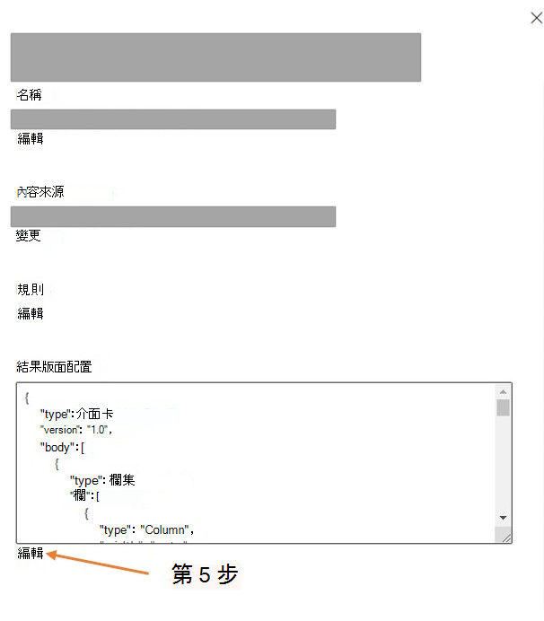

<!---Previous ms.author: kam1 --->

# <a name="servicenow-knowledge-microsoft-graph-connector"></a>ServiceNow Knowledge Microsoft Graph 連接器

使用 ServiceNow 的 Microsoft Graph 連接器，您的組織可以編制知識庫文章的索引，這些文章可供所有使用者看到，或受限於組織內的使用者準則許可權。 從 ServiceNow 設定連接器和索引內容之後，使用者就可以從任何 Microsoft Search 用戶端搜尋這些文章。  

您也可以參閱 [這段影片](https://www.youtube.com/watch?v=TVSkJpk1RiE) ，以深入瞭解 Graph 連接器在管理搜尋許可權方面所具備的功能。

本文適用于 Microsoft 365 系統管理員或設定、執行及監視 ServiceNow Knowledge Graph 連接器的任何人。 它補充Microsoft 365 系統管理中心文章[中設定 Microsoft Graph 連接器中](configure-connector.md)提供的一般指示。 如果您尚未這麼做，請閱讀整個 Graph 連接器設定一文，以瞭解一般設定程式。

安裝程式中的每個步驟都列在下方，並附上一個附注，指出您應該遵循一般設定指示或僅適用于 ServiceNow 連接器的其他指示，包括 [疑難排解](#troubleshooting) 和 [限制的相關](#limitations)資訊。  

## <a name="step-1-add-a-connector-in-the-microsoft-365-admin-center"></a>步驟 1：在Microsoft 365 系統管理中心中新增連接器。
請遵循一般 [設定指示](./configure-connector.md)。

## <a name="step-2-name-the-connection"></a>步驟 2：為連線命名。
請遵循一般 [設定指示](./configure-connector.md)。

## <a name="step-3-connection-settings"></a>步驟 3：連線設定
若要連線到您的 ServiceNow 資料，您需要組織的 **ServiceNow 實例 URL**。 貴組織的 ServiceNow 實例 URL 通常看起來像 **您 HTTPs:// &lt; 組織網域>.service-now.com**。 

除了此 URL，您還需要服務 **帳戶** 來設定 ServiceNow 的連線，以及允許 Microsoft Search 根據重新整理排程定期更新知識文章。 服務帳戶需要下列 **ServiceNow 資料表記錄的** 讀取權限，才能成功編目各種實體。

**功能** | **讀取存取必要資料表** | **描述**
--- | --- | ---
為<em>所有人</em>提供的知識文章編制索引 | kb_knowledge | 編目知識文章
索引和支援使用者準則許可權 | kb_uc_can_read_mtom | 誰可以閱讀此知識庫
| | kb_uc_can_contribute_mtom | 誰可以參與此知識庫
| | kb_uc_cannot_read_mtom | 誰無法讀取此知識庫
| | kb_uc_cannot_contribute_mtom | 誰無法參與此知識庫
| | sys_user | 讀取使用者資料表
| | sys_user_has_role | 讀取使用者的角色資訊
| | sys_user_grmember | 讀取使用者的群組成員資格
| | user_criteria | 讀取使用者準則許可權
| | kb_knowledge_base | 讀取知識庫資訊
索引擴充資料表屬性 (選擇性)  | sys_db_object | 讀取擴充資料表詳細資料
| | sys_dictionary | 讀取擴充資料表屬性

您可以為用來與 Microsoft Search 連線 **的服務帳戶建立並指派角色** 。 [瞭解如何指派 ServiceNow 帳戶的角色](https://docs.servicenow.com/bundle/paris-platform-administration/page/administer/users-and-groups/task/t_AssignARoleToAUser.html)。 您可以在建立的角色上指派資料表的讀取存取權。 若要瞭解如何設定資料表記錄的讀取權限，請參閱 [保護資料表記錄](https://developer.servicenow.com/dev.do#!/learn/learning-plans/orlando/new_to_servicenow/app_store_learnv2_securingapps_orlando_creating_and_editing_access_controls)。 

如果您想要從 *kb_knowledge* 的擴充 [資料表](https://docs.servicenow.com/bundle/rome-platform-administration/page/administer/table-administration/concept/table-extension-and-classes.html_)編制屬性的索引，請提供sys_dictionary和sys_db_object的讀取權限。 這是選擇性功能。 您將能夠 *編制kb_knowledge* 資料表屬性的索引，而不需要存取兩個額外的資料表。


>[!NOTE]
> ServiceNow Microsoft Graph 連接器可以編制知識文章和使用者準則許可權的索引，而不需要進階腳本。 如果使用者準則包含進階腳本，所有相關的知識文章都會隱藏在搜尋結果中。

若要從 ServiceNow 驗證和同步處理內容，請選擇 **三種支援的方法之一** ：

- 基本驗證
- ServiceNow OAuth (建議) 
- Azure AD OpenID Connect

## <a name="step-31-basic-authentication"></a>步驟 3.1：基本驗證

輸入具有 **知識** 角色的 ServiceNow 帳戶使用者名稱和密碼，以向您的實例進行驗證。

## <a name="step-32-servicenow-oauth"></a>步驟 3.2：ServiceNow OAuth

若要使用 ServiceNow OAuth 進行驗證，ServiceNow 系統管理員必須在 ServiceNow 實例中布建端點，Microsoft Search 應用程式才能存取它。 若要深入瞭解，請參閱 ServiceNow 檔中的 [建立端點供客戶](https://docs.servicenow.com/bundle/newyork-platform-administration/page/administer/security/task/t_CreateEndpointforExternalClients.html) 端存取實例。

下表提供如何填寫端點建立表單的指引：

欄位 | 描述 | 建議值
--- | --- | ---
名稱 | 唯一值，識別您需要 OAuth 存取權的應用程式。 | Microsoft 搜尋
用戶端識別碼 | 應用程式的唯讀、自動產生的唯一識別碼。 實例會在要求存取權杖時使用用戶端識別碼。 | NA
用戶端密碼 | 使用這個共用的秘密字串，ServiceNow 實例和 Microsoft Search 會互相授權通訊。 | 請將秘密視為密碼，以遵循安全性最佳做法。
重新導向 URL | 授權伺服器重新導向的必要回呼 URL。 | 針對 **M365 Enterprise**：HTTPs:// <span>gcs.office。</span>com/v1.0/admin/oauth/callback，</br> 針對 **M365 Government**：HTTPs:// <span> gcsgcc.office。 <span>com/v1.0/admin/oauth/callback
標誌 URL | 包含應用程式標誌影像的 URL。 | NA
作用中 | 選取核取方塊，讓應用程式登錄成為使用中狀態。 | 設定為使用中
重新整理權杖生命週期 | 重新整理權杖有效的秒數。 根據預設，重新整理權杖會在) 8，640，000 秒 (100 天后過期。 | 31，536，000 (一年) 
存取權杖存留期 | 存取權杖有效的秒數。 | 43，200 (12 小時) 

輸入用戶端識別碼和用戶端密碼以連線到您的實例。 連線之後，請使用 ServiceNow 帳號憑證來驗證編目許可權。 帳戶至少應具有 **知識** 角色。 請參閱 [步驟 3：連線設定](#step-3-connection-settings) 開頭的資料表，以提供更多 ServiceNow 資料表記錄的讀取權限，以及索引使用者準則許可權。

## <a name="step-33-azure-ad-openid-connect"></a>步驟 3.3：Azure AD OpenID Connect

若要使用 Azure AD OpenID Connect 進行驗證，請遵循下列步驟。

### <a name="step-331-register-a-new-application-in-azure-active-directory"></a>步驟 3.3.1：在 Azure Active Directory 中註冊新的應用程式

若要瞭解如何在 Azure Active Directory 中註冊新的應用程式，請參閱 [註冊應用程式](/azure/active-directory/develop/quickstart-register-app#register-an-application)。 選取單一租使用者組織目錄。 不需要重新導向 URI。 註冊之後，記下應用程式 (用戶端) 識別碼和目錄 (租使用者) 識別碼。

### <a name="step-332-create-a-client-secret"></a>步驟 3.3.2：建立用戶端密碼

若要瞭解如何建立用戶端密碼，請參閱 [建立用戶端密碼](/azure/active-directory/develop/quickstart-register-app#add-a-client-secret)。 記下用戶端密碼。

### <a name="step-333-retrieve-service-principal-object-identifier"></a>步驟 3.3.3：擷取服務主體物件識別碼

請遵循步驟來擷取服務主體物件識別碼

1. 執行 PowerShell。

2. 使用下列命令安裝 Azure PowerShell。

   ```powershell
   Install-Module -Name Az -AllowClobber -Scope CurrentUser
   ```

3. 連線到 Azure。

   ```powershell
   Connect-AzAccount
   ```

4. 取得服務主體物件識別碼。

   ```powershell
   Get-AzADServicePrincipal -ApplicationId "Application-ID"
   ```
   將 「Application-ID」 取代為應用程式 (用戶端) 識別碼， (不含您在步驟 3.a 中註冊之應用程式的引號) 。 請注意 PowerShell 輸出中 ID 物件的值。 這是服務主體識別碼。

現在您已擁有Azure 入口網站所需的所有資訊。 下表提供資訊的快速摘要。

屬性	 | 描述
--- | ---
租使用者識別碼 (目錄識別碼)  | 步驟 3.a 中 Azure Active Directory 租使用者的唯一識別碼。
應用程式識別碼 (用戶端識別碼)  | 步驟 3.a 中註冊之應用程式的唯一識別碼。
用戶端密碼 | 從步驟 3.b)  (應用程式的秘密金鑰。 將其視為密碼。
服務主體識別碼 | 作為服務執行之應用程式的身分識別。 從步驟 3.c)  (

### <a name="step-334-register-servicenow-application"></a>步驟 3.3.4：註冊 ServiceNow 應用程式

ServiceNow 實例需要下列設定：

1. 註冊新的 OAuth OIDC 實體。 若要瞭解，請 [參閱建立 OAuth OIDC 提供者](https://docs.servicenow.com/bundle/orlando-platform-administration/page/administer/security/task/add-OIDC-entity.html)。

2. 下表提供如何填寫 OIDC 提供者註冊表單的指引

   欄位 | 描述 | 建議值
   --- | --- | ---
   名稱 | 識別 OAuth OIDC 實體的唯一名稱。 | Azure AD
   用戶端識別碼 | 在協力廠商 OAuth OIDC 伺服器中註冊之應用程式的用戶端識別碼。 實例會在要求存取權杖時使用用戶端識別碼。 | 步驟 3.a 中的應用程式 (用戶端) 識別碼
   用戶端密碼 | 在協力廠商 OAuth OIDC 伺服器中註冊之應用程式的用戶端密碼。 | 步驟 3.b 中的用戶端密碼

   所有其他值都可以是預設值。

3. 在 OIDC 提供者註冊表單中，您需要新增 OIDC 提供者設定。 針對 *[OAuth OIDC 提供者* 設定] 欄位選取搜尋圖示，以開啟 OIDC 設定的記錄。 選取 [新增]。

4. 下表提供如何填寫 OIDC 提供者組態表單的指引

   欄位 | 建議值
   --- | ---
   OIDC 提供者 |  Azure AD
   OIDC 中繼資料 URL | URL 的格式必須是 HTTPs \: //login.microsoftonline.com/<tenandId「>/.well-known/openid-configuration <br/>將 「tenantID」 取代為步驟 3.a 中的目錄 (租使用者) 識別碼。
   OIDC 組態快取生命週期 |  120
   應用程式 | 全域
   使用者宣告 | 子
   使用者欄位 | 使用者識別碼
   啟用 JTI 宣告驗證 | 已停用

5. 選取 [提交] 並更新 [OAuth OIDC 實體] 表單。

### <a name="step-335-create-a-servicenow-account"></a>步驟 3.3.5：建立 ServiceNow 帳戶

請參閱建立 ServiceNow 帳戶、 [在 ServiceNow 中建立使用者的](https://docs.servicenow.com/bundle/paris-platform-administration/page/administer/users-and-groups/task/t_CreateAUser.html)指示。

下表提供如何填寫 ServiceNow 使用者帳戶註冊的指引

欄位 | 建議值
--- | ---
使用者識別碼 | 步驟 3.c 的服務主體識別碼
僅限 Web 服務存取 | Checked

所有其他值都可以保留為預設值。

### <a name="step-336-enable-knowledge-role-for-the-servicenow-account"></a>步驟 3.3.6：啟用 ServiceNow 帳戶的知識角色

存取您以 ServiceNow 主體識別碼作為使用者識別碼建立的 ServiceNow 帳戶，並指派知識角色。 您可以在這裡找到將角色指派給 ServiceNow 帳戶的指示， [並將角色指派給使用者](https://docs.servicenow.com/bundle/paris-platform-administration/page/administer/users-and-groups/task/t_AssignARoleToAUser.html)。 請參閱 [步驟 3：連線設定](#step-3-connection-settings) 開頭的資料表，以提供更多 ServiceNow 資料表記錄的讀取權限，以及索引使用者準則許可權。

使用步驟 3.a) 中的應用程式識別碼作為用戶端識別碼 (，以及從系統管理中心設定精靈中的步驟 3.b) 的用戶端密碼 (，使用 Azure AD OpenID Connect 向您的 ServiceNow 實例進行驗證。

## <a name="step-4-select-properties-and-filter-data"></a>步驟 4：選取屬性並篩選資料

在此步驟中，您可以從 ServiceNow 資料來源新增或移除可用的屬性。 Microsoft 365 預設已經選取幾個屬性。

使用 ServiceNow 查詢字串，您可以指定同步發行項的條件。 它就像 **SQL Select** 語句中的 **Where** 子句。 例如，您可以選擇只為已發行和使用中的發行項編制索引。 若要瞭解如何建立您自己的查詢字串，請參閱 [使用篩選產生編碼的查詢字串](https://docs.servicenow.com/bundle/paris-platform-user-interface/page/use/using-lists/task/t_GenEncodQueryStringFilter.html)。

使用 [預覽結果] 按鈕來驗證所選屬性和查詢篩選的範例值。

## <a name="step-5-manage-search-permissions"></a>步驟 5：管理搜尋許可權

ServiceNow 連接器支援 **所有人** 或 **只有具有此資料來源存取權的人員可以看見的搜尋許可權**。 已編制索引的資料會出現在搜尋結果中，且組織中的所有使用者或分別可透過使用者準則許可權存取這些資料的使用者可以看到。 如果未啟用使用者準則的知識文章，它會出現在組織中每個人的搜尋結果中。

連接器支援沒有進階腳本的預設使用者準則許可權。 當連接器遇到具有進階腳本的使用者準則時，使用該使用者準則的所有資料都不會出現在搜尋結果中。

如果您選擇 **[僅限可存取此資料來源的人員**]，則必須進一步選擇您的 ServiceNow 實例是否具有 Azure Active Directory (AAD) 布建的使用者或非 AAD 使用者。

若要識別哪個選項適合您的組織：

1. 如果 ServiceNow 使用者的Email識別碼與 **AAD** 中使用者的 UPN) UserPrincipalName (**相同**，請選擇 [AAD] 選項。
2. 如果 ServiceNow 使用者的電子郵件識別碼與 **AAD** 中使用者的 USERPrincipalName (UPN) **不同** ，請選擇 [非 AAD] 選項。 

>[!NOTE]
> * 如果您選擇 AAD 作為身分識別來源的類型，連接器會將從 ServiceNow 取得的使用者Email識別碼直接對應至 AAD 的 UPN 屬性。
> * 如果您針對身分識別類型選擇 [非 AAD]，請參閱對應 [您的非 Azure AD 身](map-non-aad.md) 分識別以取得對應身分識別的指示。 您可以使用此選項來提供從EMAIL識別碼到 UPN 的對應正則運算式。


## <a name="step-6-assign-property-labels"></a>步驟 6：指派屬性標籤

請遵循一般 [設定指示](./configure-connector.md)。

## <a name="step-7-manage-schema"></a>步驟 7：管理架構

請遵循一般 [設定指示](./configure-connector.md)。

## <a name="step-8-choose-refresh-settings"></a>步驟 8：選擇重新整理設定

請遵循一般 [設定指示](./configure-connector.md)。

>[!NOTE]
>針對身分識別，只會套用完整編目排程。

## <a name="step-9-review-connection"></a>步驟 9：檢閱連線

請遵循一般 [設定指示](./configure-connector.md)。

發佈連線之後，您必須自訂搜尋結果頁面。 若要瞭解如何自訂搜尋結果，請參閱 [自訂搜尋結果頁面](/microsoftsearch/configure-connector#next-steps-customize-the-search-results-page)。

## <a name="limitations"></a>限制
ServiceNow Knowledge Microsoft Graph 連接器在其最新版本中具有下列限制：

- *只有具有 [* 管理搜尋許可權] 步驟下此資料來源功能存取權的人員，只會處理 [使用者準則](https://hi.service-now.com/kb_view.do?sysparm_article=KB0550924) 許可權。 搜尋結果中將不會套用任何其他類型的存取權限。
- 目前版本不支援具有進階腳本的使用者準則。 任何具有這類存取限制的知識文章都會編制索引，並拒絕所有人存取，也就是除非我們支援使用者，否則不會在搜尋結果中顯示給任何使用者。

## <a name="troubleshooting"></a>疑難排解
發佈連線、自訂結果頁面之後，您可以在 [系統管理中心的](https://admin.microsoft.com)[**資料來源**] 索引標籤下檢閱狀態。 若要瞭解如何進行更新和刪除，請參閱 [管理您的連接器](manage-connector.md)。
您可以在下方找到常見問題的疑難排解步驟。
### <a name="1-unable-to-log-in-due-to-single-sign-on-enabled-servicenow-instance"></a>1.無法登入，因為已啟用單一Sign-On ServiceNow 實例

如果您的組織已啟用單一Sign-On (SSO) 至 ServiceNow，您可能無法使用服務帳戶登入。 您可以將 新<em> `login.do` </em>增至 ServiceNow 實例 URL，以顯示使用者名稱和密碼型登入。 例子。 `https://<your-organization-domain>.service-now.com./login.do`

### <a name="2-unauthorized-or-forbidden-response-to-api-request"></a>2.未經授權或禁止回應 API 要求

#### <a name="21-check-table-access-permissions"></a>2.1. 檢查資料表存取權限
如果您在線上狀態中看到禁止或未經授權的回應，請檢查服務帳戶是否具有 [步驟 3：連線設定](#step-3-connection-settings)中所述資料表的必要存取權。 請檢查資料表中的所有資料行是否具有讀取權限。

#### <a name="22-change-in-account-password"></a>2.2. 變更帳戶密碼
Microsoft Graph 連接器會使用代表服務帳戶擷取的存取權杖進行編目。 存取權杖會每隔 12 小時重新整理一次。 請確定發佈連線之後，服務帳戶密碼不會變更。 如果密碼有變更，您可能需要重新驗證連線。

#### <a name="23-check-if-servicenow-instance-behind-firewall"></a>2.3. 檢查防火牆後方的 ServiceNow 實例
如果 ServiceNow 實例位於網路防火牆後方，則 Microsoft Graph 連接器可能無法連線到該實例。 您必須明確允許存取連接器服務。 您可以在下表中找到連接器服務的公用 IP 位址範圍。 根據您的租使用者區域，將它新增至您的 ServiceNow 實例網路允許清單。

**環境** | **地區** | **Range**
--- | --- | ---
PROD | 北美 | 52.250.92.252/30, 52.224.250.216/30
PROD | 歐洲 | 20.54.41.208/30, 51.105.159.88/30
PROD | 亞太地區 | 52.139.188.212/30, 20.43.146.44/30

#### <a name="24-access-permissions-not-working-as-expected"></a>2.4. 存取權限未如預期般運作

如果您觀察到套用至搜尋結果的存取權限不一致，請確認存取流程圖中的使用者準則， [以管理知識庫和文章的存取](https://docs.servicenow.com/bundle/rome-servicenow-platform/page/product/knowledge-management/concept/user-access-knowledge.html)權。

### <a name="3-change-the-url-of-the-knowledge-article-to-view-it-in-the-support-portal"></a>3.變更知識文章的 URL 以在支援入口網站中檢視

ServiceNow Knowledge 連接器會使用格式的sys_id `<instance_url>/kb_view.do?sys_kb_id<sysId>` 來計算 AccessUrl 屬性。 它會在後端系統檢視中開啟知識文章。 如果您偏好將文章重新導向至不同的 URL，請遵循下列指示。
#### <a name="31-edit-your-result-type"></a>3.1 編輯結果類型
在 Microsoft 365 系統管理中心 的 *[搜尋&智慧*] 區段的 [自訂] 索引標籤中，流覽以編輯為 ServiceNow 知識連線設定的結果類型。


當 [編輯結果類型] 對話方塊開啟時，按一下 [結果配置] 區段旁的 [ **編輯** ]。 


#### <a name="32-find-the-items-block"></a>3.2 尋找專案區塊
尋找包含具有 和 `AccessUrl` 值之文字屬性 `shortDescription` 的專案區塊。


#### <a name="33-edit-accessurl-property"></a>3.3 編輯 AccessUrl 屬性

若要變更目的地 URL，請編輯 `AccessUrl` 專案區塊中的文字屬性部分。 例如，如果 ServiceNow 知識文章應該重新導向至 `https://contoso.service-now.com/sp` 其中 `sp` 是服務 URL 入口網站前置詞，請遵循下列步驟。

**原始值** | **新值**
--- | ---
`"[{shortdescription}]({AccessUrl})"` | `"[{shortdescription}](https://contoso.service-now.com/sp?id=kb_article_view&sysparm_article={number})"`

其中 `number` 是知識文章數位屬性。 在建立連線期間，應該在 [管理架構] 畫面中將它標示為擷 *取* 。

完成檢閱結果類型更新，然後按 [ **提交]**。 提供一兩分鐘的時間來挑選變更。 您的搜尋結果現在應該會重新導向至所需的 URL。

### <a name="4-issues-with-only-people-with-access-to-this-data-source-permission"></a>4. *只有具有此資料來源許可權存取權的人員* 的問題

#### <a name="41-unable-to-choose-only-people-with-access-to-this-data-source"></a>4.1 無法選擇 *[僅限可存取此資料來源的人員]*

如果服務帳戶沒有 [步驟 3：連線設定](#step-3-connection-settings)中所需資料表的讀取權限，您可能無法選擇 [*只有可存取此資料來源的人員*] 選項。 檢查服務帳戶是否可以讀取 [ *索引] 下所述的資料表，並支援使用者準則許可權* 功能。

#### <a name="42-user-mapping-failures"></a>4.2 使用者對應失敗

 Azure Active Directory 中沒有 M365 使用者的 ServiceNow 使用者帳戶將不會對應。 非使用者的服務帳戶預期會使使用者對應失敗。 您可以在連線詳細資料視窗的身分識別統計資料區域中存取使用者對應失敗數目。 您可以從 [錯誤] 索引標籤下載失敗的使用者對應記錄。

### <a name="5-issues-with-user-criteria-access-flow"></a>5. 使用者準則存取流程的問題

如果您在 ServiceNow 和 Microsoft Search 之間看到使用者準則驗證的差異，請將系統屬性設定 `glide.knowman.block_access_with_no_user_criteria` 為 `no` 。

如果您有任何其他問題或想要提供意見反應，請寫入 [我們 aka.ms/TalkToGraphConnectors](https://aka.ms/TalkToGraphConnectors)
