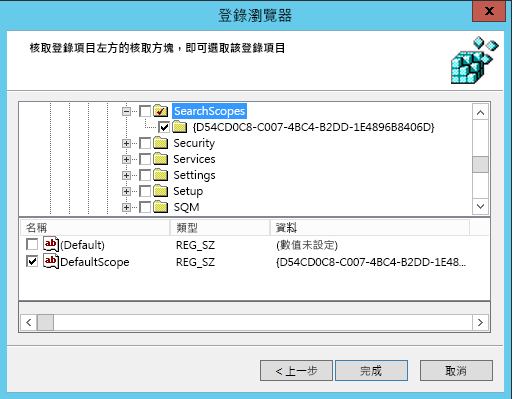

# 設定預設搜尋引擎

設定預設的瀏覽器、 預設搜尋引擎，以及預設首頁可協助您探索 Microsoft 搜尋功能、 鼓勵更多的使用狀況，並提供更順暢的使用者。
  
若要設定預設的搜尋引擎您的組織，請遵循下列步驟。
  
## Internet Explorer

### Internet Explorer 11

使用者無法變更搜尋提供者之後此原則設定。
  
#### 1.設定本機電腦將用來設定 GPO

將下列文字貼到登錄 (\*.reg) 檔案。
  
Windows 登錄編輯程式 5.00 版
  
<pre>[HKEY_CURRENT_USER\Software\Microsoft\Internet Explorer\SearchScopes]
"DefaultScope"="{D54CD0C8-C007-4BC4-B2DD-1E4896B8406D}"
[HKEY_CURRENT_USER\Software\Microsoft\Internet Explorer\SearchScopes\{D54CD0C8-C007-4BC4-B2DD-1E4896B8406D}]
"Codepage"=dword:0000fde9
"DisplayName"="Microsoft Search in Bing"
"OSDFileURL"="https://www.bing.com/sa/osd/bfb.xml"
"FaviconURL"="https://www.bing.com/sa/simg/bb.ico"
"SuggestionsURL_JSON"="https://business.ing.com/api/v2/browser/suggest?q={searchTerms}&amp;form=BFBSPA"
"ShowSearchSuggestions"=dword:00000001
"URL"="https://www.bing.com/business/search?q={searchTerms}&amp;form=BFBSPR"</pre>
  
按兩下 [建立的檔案並遵循的步驟來匯入檔案。成功匯入應該會導致下列對話方塊：
  

  
#### 2.開啟 「 群組原則管理主控台 （gpmc.msc 取得） 並切換至編輯現有的原則或建立一個新

1. 瀏覽至**使用者 Configuration\Policies\Preferences\Windows 設定**。
    
2. 以滑鼠右鍵按一下**Registry\New**並選取 [**登錄精靈**]。從登錄瀏覽器視窗中，選取 [**本機電腦**，並按一下 [**下一步**。
    
3. 瀏覽至**HKEY_CURRENT_USER\SOFTWARE\Microsoft\Internet Explorer\SearchScopes**。
    
4. 從此機碼，請務必選取 DefaultScope。
    
    
  
5. 檢查所有子機碼包含 Microsoft Search Bing 和使用者設定檔的任何路徑以外的機碼底下的每個值中的 GUID。若要選取其他項目向下捲動。
    
    
  
6. 按一下 [完成] 來完成此設定。
    
#### 3.設定使用者喜好設定來協助避免使用者可能會收到一則警告訊息時 DefaultScope 搜尋會強制執行

這則警告是根據設計和提醒程式嘗試要修改其設定的使用者。
  
1. 在相同的 GPO、 **Registry\New**上按一下滑鼠右鍵並選取**登錄精靈**]。
    
2. 瀏覽至**HKEY_CURRENT_USER\SOFTWARE\Microsoft\Internet Explorer\User 喜好設定**。
    
3. 選取的**使用者喜好設定**索引鍵。
    
4. 按一下 [完成]****。
    
5. 按一下 [在新建立的物件。右側邊窗格按兩下 [使用者喜好設定物件上，**刪除**並儲存變更**巨集指令**。
    
強制產生 GPO 連結至適當的網域。
  
## Microsoft Edge

### Windows 10、 1703 或更新版本

使用者無法變更搜尋提供者之後此原則設定。
  
各版本 Windows 的最新的 ADMX 檔案，請參閱 ＜[如何建立和管理群組原則系統管理範本 Windows 中的中央存放區](https://support.microsoft.com/en-us/help/3087759/how-to-create-and-manage-the-central-store-for-group-policy-administra)。
  
如果內部 GPMC 找不到此節所述的設定，下載適當的 ADMX，並將其複製到集中存放區。如需詳細資訊，請參閱[參閱 Gpo 使用 ADMX 檔案](https://docs.microsoft.com/en-us/previous-versions/windows/it-pro/windows-vista/cc748955%28v%3dws.10%29)。控制站上的集中存放區已有下列的命名慣例的資料夾：
  
 **%systemroot%\sysvol\\<domain\>\policies\PolicyDefinitions**
  
您控制站會處理每個網域應取得個別的資料夾。若要從命令提示字元中 ADMX 檔案複製可用下列命令：
  
 `Copy <path_to_ADMX.ADMX> %systemroot%\sysvol\<domain>\policies\PolicyDefinitions`
  
1. 若要編輯現有的原則或建立一個新參數和開啟 「 群組原則管理主控台 （gpmc.msc 取得）。
    
2. 瀏覽至 [**&lt;電腦/使用者設定&gt;\Administrative Templates\Windows \microsoft Edge**。
    
1. 按兩下 [**設定預設搜尋引擎**、 設為 [**已啟用**] 並輸入`https://www.bing.com/sa/osd/bfb.xml`
    
3. 強制產生 GPO 連結至適當的網域。
    
## Google Chrome

### Windows XP SP2 或更新版本

使用者將無法設定此原則之後變更搜尋提供者。
  
Chrome 隨附的群組原則設定可供下載的格式從[Google Chrome 企業協助](https://support.google.com/chrome/a/answer/187202)ADMX 檔案並將其專屬設定。如果作業系統 Windows Vista/2008年或更新版本的伺服器可用來管理 GPO 的網域，則此套件中所提供的 ADMX 檔案負責的 Chrome 設定在 Windows XP SP2 或更新版本。
  
將範本檔案複製到 ADMX 檔案的網域控制站上集中存放區。如需詳細資訊，請參閱[參閱 Gpo 使用 ADMX 檔案](https://docs.microsoft.com/en-us/previous-versions/windows/it-pro/windows-vista/cc748955%28v%3dws.10%29)。控制站上的集中存放區已有下列的命名慣例的資料夾：
  
 **%systemroot%\sysvol\\<domain\>\policies\PolicyDefinitions**
  
您控制站會處理每個網域應取得個別的資料夾。若要從命令提示字元中 ADMX 檔案複製可用下列命令：
  
 `Copy <path_to_Chrome.ADMX> %systemroot%\sysvol\<domain>\policies\PolicyDefinitions`
  
1. 若要編輯的任何現有原則或建立一個新參數和開啟 「 群組原則管理主控台 （gpmc.msc 取得）。
    
2. 請確定下列資料夾會出現在 [系統管理範本] 區段中的兩個使用者/電腦設定： Google Chrome 及 Google Chrome-預設設定。
    
  - 修正第一個區段的設定和本機系統管理員將無法在瀏覽器中加以變更。
    
  - 在瀏覽器設定的使用者可以變更的後面] 區段中的原則設定。
    
3. 瀏覽至 [**\<電腦/使用者\>\ 系統管理範本 Templates\Google Chrome\Default 搜尋提供者**
    
4. 按兩下 [**啟用的預設搜尋提供者**，並將它設為 [**已啟用**。
    
5. 按兩下 [**預設搜尋提供者] 圖示**、 將它設為 [**已啟用**] 並輸入`https://www.bing.com/sa/simg/bb.ico`
    
6. 按兩下 [**預設的搜尋提供者立即 URL**，然後輸入`https://www.bing.com/business/search?q={searchTerms}&amp;form=BFBSPR`
    
7. 按兩下 [**預設的搜尋提供者名稱**、 將它設為 [啟用] 並輸入 ' Microsoft 搜尋中 Bing'
    
8. 按兩下 [**預設搜尋提供者搜尋 URL**、 將它設為 [**已啟用**] 並輸入`https://www.bing.com/business/search?q={searchTerms}&amp;form=BFBSPR`
    
9. 按兩下 [**預設搜尋提供者建議 URL**、 將它設為 [**已啟用**] 並輸入`https://business.bing.com/api/v2/browser/suggest?q={searchTerms}&amp;form=BFBSPA`
    
10. 強制產生 GPO 連結至適當的網域。
    
設定預設的搜尋引擎會新增 Microsoft Search 搜尋建議功能在瀏覽器網址列中。目前這支援僅書籤。當他們在網址列中輸入使用者會看到公用 web 建議上方的頂端兩個書籤建議。